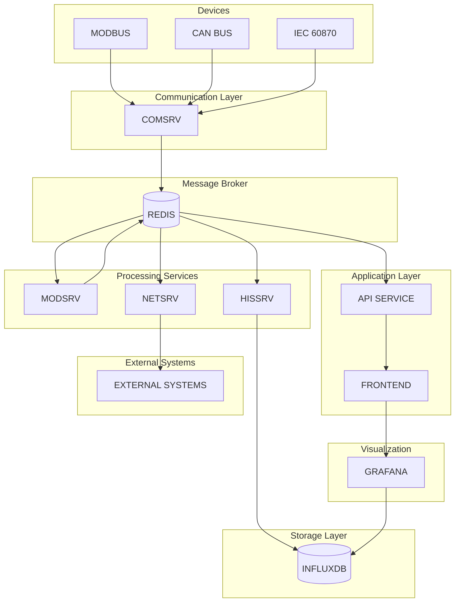
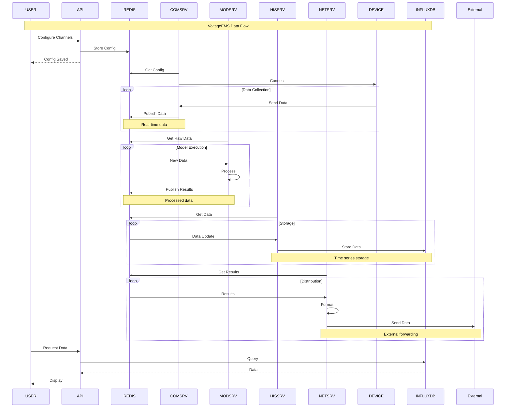

# Energy Management System (EMS)

The Energy Management System is a collection of microservices used to monitor, control and optimize energy infrastructure.

## Service Components

- **Comsrv**: communication service that collects real-time data from devices
- **Hissrv**: historical data service that writes real-time values to a time series database
- **Modsrv**: model service executing real-time calculations and control logic
- **Netsrv**: network service that forwards data to external systems via multiple protocols
- **Frontend Configuration Platform**: Vue.js based web application for editing service configuration
- **API Service**: backend interface used by the frontend to read and write configuration
- **Grafana**: visualization platform embedded in the frontend

### Comsrv Highlights

- Supports Modbus TCP/RTU, CAN and custom protocols
- Asynchronous architecture for high concurrency and scalability
- REST API for channel management and status monitoring
- YAML/CSV based configuration for channels and point tables
- Integrated Prometheus metrics and structured logging

## System Architecture

The services communicate via Redis as shown below:



## Data Flow

The complete data processing flow through the system is illustrated below:



## Technology Stack

- **Comsrv**: Rust
- **Hissrv**: Rust
- **Modsrv**: Rust
- **Netsrv**: Rust
- **Frontend**: Vue.js with Element Plus
- **API Service**: Node.js with Express
- **Storage**: Redis and InfluxDB
- **Visualization**: Grafana
- **Containerization**: Docker and Docker Compose

## Quick Start

### Prerequisites

- Docker and Docker Compose
- Rust 1.67+ (for development)
- Rust toolchain (for Comsrv development)
- Node.js 16+ (for frontend and API development)

### Start with Docker Compose

```bash
# start all services
docker-compose up -d

# view logs
docker-compose logs -f

# stop all services
docker-compose down
```

### Accessing Services

- **Frontend**: http://localhost:8080
- **Grafana**: http://localhost:8080/grafana or http://localhost:3000
- **InfluxDB UI**: http://localhost:8086

### Development Setup

Each service has its own README with detailed instructions.

#### Frontend Development

```bash
cd frontend
npm install
npm run serve
```

#### API Development

```bash
cd api
npm install
npm run dev
```

## Configuration

All configuration files live under the `config` directory grouped by service:

- **Comsrv**: `config/comsrv/`
- **Hissrv**: `config/hissrv/`
- **Modsrv**: `config/modsrv/modsrv.toml`
- **Netsrv**: `config/netsrv/netsrv.json`
- **Mosquitto**: `config/mosquitto/mosquitto.conf`
- **Certificates**: `config/certs/`

Centralizing configuration in this way keeps the system organized and easy to maintain.

### Configuration Platform

The web based platform offers:

1. **Intuitive UI** powered by Element Plus
2. **Live editing** with save support
3. **Validation** of configuration files
4. **Visualization** via the embedded Grafana

## License

[Your license]

# Communication Service Test Tools

These tools assist with developing and testing the Comsrv service.

## Tool List

- **test_api.py** – tests the Comsrv REST API
- **load_test.py** – performs load testing
- **modbus_simulator.py** – Modbus TCP simulator
- **opcua_simulator.py** – OPC UA simulator
- **generate_config.py** – generates channel and point configurations

## Installing Dependencies

```bash
# common
pip install requests

# Modbus simulator
pip install pymodbus

# OPC UA simulator
pip install opcua
```

## Usage

### API Test Script (test_api.py)

```bash
python test_api.py
```

### Load Test Script (load_test.py)

```bash
# default
python load_test.py

# custom parameters
python load_test.py --url http://localhost:8080/api --threads 20 --requests 2000 --read-ratio 70
```

### Modbus Simulator (modbus_simulator.py)

```bash
# default
python modbus_simulator.py

# custom parameters
python modbus_simulator.py --host 0.0.0.0 --port 502 --slave-id 1 --update-interval 2.0
```

### OPC UA Simulator (opcua_simulator.py)

```bash
# default
python opcua_simulator.py

# custom parameters
python opcua_simulator.py --host 0.0.0.0 --port 4840 --update-interval 2.0
```

### Configuration Generator (generate_config.py)

```bash
# default
python generate_config.py

# custom parameters
python generate_config.py --output ./my_config --modbus 3 --opcua 2 --points 30
```

## Typical Test Flow

1. Generate test configuration:
   ```bash
   python generate_config.py --output ./test_config
   ```
2. Start protocol simulators:
   ```bash
   python modbus_simulator.py --port 502
   python opcua_simulator.py --port 4840
   ```
3. Launch Comsrv pointing to the config directory:
   ```bash
   cargo run --bin comsrv -- --config-dir ./test_tools/test_config
   ```
4. Run the API tests:
   ```bash
   python test_api.py
   ```
5. Execute the load test:
   ```bash
   python load_test.py --threads 20 --requests 5000
   ```

## Notes

- Comsrv listens on port 8080 by default.
- The Modbus simulator uses port 502 which may require elevated privileges.
- Adjust configuration for production deployments.
- Monitor system resources during load tests to avoid overload.

# Modbus Native

[](https://www.rust-lang.org/)
[](https://opensource.org/licenses/MIT)

A high-performance, native Modbus TCP/RTU implementation in Rust designed for industrial automation and IoT applications.

## 🚀 Features

- **Pure Rust Implementation**: No external C dependencies
- **Async/Await Support**: Built on Tokio for high concurrency
- **Protocol Support**: Both Modbus TCP and RTU (RTU coming soon)
- **High Performance**: Optimized for throughput and low latency
- **Error Resilience**: Comprehensive error handling and recovery
- **Production Ready**: Extensive testing and validation
- **Thread Safe**: All operations are thread-safe and can be used in concurrent environments

## 📦 Installation

Add this to your `Cargo.toml`:

```toml
[dependencies]
modbus_native = "0.1.0"
```

## 🛠️ Quick Start

### Basic Usage

```rust
use modbus_native::{ModbusTcpClient, ModbusClient};

#[tokio::main]
async fn main() -> Result<(), Box<dyn std::error::Error>> {
    // Connect to Modbus server
    let mut client = ModbusTcpClient::new("127.0.0.1:502").await?;
  
    // Read holding registers
    let values = client.read_holding_registers(1, 100, 10).await?;
    println!("Read registers: {:?}", values);
  
    // Write single register
    client.write_single_register(1, 100, 0x1234).await?;
  
    // Write multiple registers
    let values = vec![0x1111, 0x2222, 0x3333];
    client.write_multiple_registers(1, 200, &values).await?;
  
    // Read coils
    let coils = client.read_coils(1, 0, 16).await?;
    println!("Coil values: {:?}", coils);
  
    // Write coils
    let coil_values = vec![true, false, true, false];
    client.write_multiple_coils(1, 10, &coil_values).await?;
  
    client.close().await?;
    Ok(())
}
```

### Advanced Usage with Custom Timeout

```rust
use modbus_native::{ModbusTcpClient, ModbusClient};
use std::time::Duration;

#[tokio::main]
async fn main() -> Result<(), Box<dyn std::error::Error>> {
    // Connect with custom timeout
    let timeout = Duration::from_secs(10);
    let mut client = ModbusTcpClient::with_timeout("192.168.1.100:502", timeout).await?;
  
    // Perform operations...
  
    // Get connection statistics
    let stats = client.get_stats();
    println!("Requests sent: {}", stats.requests_sent);
    println!("Success rate: {:.1}%", 
        (stats.responses_received as f64 / stats.requests_sent as f64) * 100.0);
  
    Ok(())
}
```

## 🧪 Testing

The project includes comprehensive testing tools and a Python test server.

### Running the Demo

```bash
# Start the test server (in one terminal)
python3 test/modbus_test_server.py

# Run the demo (in another terminal)
cargo run --bin demo
```

### Performance Testing

```bash
# Start the test server
python3 test/modbus_test_server.py &

# Run performance tests
cargo run --bin performance_test

# Run with custom parameters
cargo run --bin performance_test -- --server 127.0.0.1:502 --clients 20 --requests 1000
```

### Performance Test Options

- `--server <ADDR>`: Server address (default: 127.0.0.1:502)
- `--slave-id <ID>`: Slave ID (default: 1)
- `--clients <N>`: Concurrent clients (default: 10)
- `--requests <N>`: Requests per client (default: 100)
- `--duration <SECS>`: Stress test duration (default: 30)
- `--delay <MS>`: Delay between requests (default: 10)

## 📊 Performance

The library is designed for high performance with the following benchmarks on a typical development machine:

- **Throughput**: >2000 requests/second with 10 concurrent clients
- **Latency**: <5ms average response time on localhost
- **Memory**: Low memory footprint with efficient connection pooling
- **Concurrency**: Excellent scalability with increasing client count

## 🔧 API Reference

### ModbusClient Trait

The main interface for Modbus operations:

```rust
#[async_trait]
pub trait ModbusClient: Send + Sync {
    async fn read_coils(&mut self, slave_id: u8, address: u16, quantity: u16) -> ModbusResult<Vec<bool>>;
    async fn read_discrete_inputs(&mut self, slave_id: u8, address: u16, quantity: u16) -> ModbusResult<Vec<bool>>;
    async fn read_holding_registers(&mut self, slave_id: u8, address: u16, quantity: u16) -> ModbusResult<Vec<u16>>;
    async fn read_input_registers(&mut self, slave_id: u8, address: u16, quantity: u16) -> ModbusResult<Vec<u16>>;
    async fn write_single_coil(&mut self, slave_id: u8, address: u16, value: bool) -> ModbusResult<()>;
    async fn write_single_register(&mut self, slave_id: u8, address: u16, value: u16) -> ModbusResult<()>;
    async fn write_multiple_coils(&mut self, slave_id: u8, address: u16, values: &[bool]) -> ModbusResult<()>;
    async fn write_multiple_registers(&mut self, slave_id: u8, address: u16, values: &[u16]) -> ModbusResult<()>;
    fn is_connected(&self) -> bool;
    async fn close(&mut self) -> ModbusResult<()>;
    fn get_stats(&self) -> TransportStats;
}
```

### Supported Function Codes

- **0x01**: Read Coils
- **0x02**: Read Discrete Inputs
- **0x03**: Read Holding Registers
- **0x04**: Read Input Registers
- **0x05**: Write Single Coil
- **0x06**: Write Single Register
- **0x0F**: Write Multiple Coils
- **0x10**: Write Multiple Registers

### Data Type Utilities

The library includes utilities for working with different data types:

```rust
use modbus_native::client::utils;

// Convert registers to different types
let registers = vec![0x1234, 0x5678];
let u32_values = utils::registers_to_u32_be(&registers);
let f32_values = utils::registers_to_f32_be(&registers);

// Convert back to registers
let back_to_regs = utils::u32_to_registers_be(&u32_values);
```

## 🚨 Error Handling

The library provides comprehensive error handling:

```rust
use modbus_native::{ModbusError, ModbusResult};

match client.read_holding_registers(1, 100, 10).await {
    Ok(values) => println!("Success: {:?}", values),
    Err(ModbusError::Timeout { operation, timeout_ms }) => {
        println!("Operation '{}' timed out after {}ms", operation, timeout_ms);
    },
    Err(ModbusError::Protocol { message }) => {
        println!("Protocol error: {}", message);
    },
    Err(e) => println!("Other error: {}", e),
}
```

## 🔍 Logging

Enable logging to see detailed operation information:

```rust
env_logger::init();
```

Or set the `RUST_LOG` environment variable:

```bash
RUST_LOG=debug cargo run --bin demo
```

## 🧩 Examples

The `examples/` directory contains various usage examples:

- **Basic Operations**: Simple read/write operations
- **Concurrent Access**: Multiple clients accessing the same server
- **Error Handling**: Comprehensive error handling examples
- **Performance Monitoring**: Using built-in statistics

## 🤝 Contributing

Contributions are welcome! Please feel free to submit a Pull Request. For major changes, please open an issue first to discuss what you would like to change.

### Development Setup

1. Clone the repository
2. Install Rust (latest stable)
3. Install Python 3.7+ (for test server)
4. Run tests: `cargo test`
5. Run examples: `cargo run --bin demo`

### Testing

```bash
# Run unit tests
cargo test

# Run integration tests with server
python3 test/modbus_test_server.py &
cargo run --bin performance_test
```

## 📝 License

This project is licensed under the MIT License - see the [LICENSE](LICENSE) file for details.

## 🙏 Acknowledgments

- Built with [Tokio](https://tokio.rs/) for async runtime
- Inspired by the Modbus specification and existing implementations
- Thanks to the Rust community for excellent crates and tools

## 📞 Support

- 📚 [Documentation](https://docs.rs/modbus_native)
- 🐛 [Issue Tracker](https://github.com/voltage-ems/modbus_native/issues)
- 💬 [Discussions](https://github.com/voltage-ems/modbus_native/discussions)

---

Made with ❤️ by the VoltageEMS Team
