# Energy Management System (EMS)

The Energy Management System is a collection of microservices used to monitor, control and optimize energy infrastructure.

## Service Components

- **Comsrv**: communication service that collects real-time data from devices
- **Hissrv**: historical data service that writes real-time values to a time series database
- **Modsrv**: model service executing real-time calculations and control logic
- **Netsrv**: network service that forwards data to external systems via multiple protocols
- **Alarmsrv**: intelligent alarm management service with classification, Redis storage, and cloud integration
- **Frontend Configuration Platform**: Vue.js based web application for editing service configuration
- **API Service**: backend interface used by the frontend to read and write configuration
- **Grafana**: visualization platform embedded in the frontend

### Comsrv Highlights

- Supports Modbus TCP/RTU, CAN and custom protocols
- Asynchronous architecture for high concurrency and scalability
- REST API for channel management and status monitoring
- YAML/CSV based configuration for channels and point tables
- Integrated Prometheus metrics and structured logging

### Alarmsrv Highlights

- **Intelligent Classification**: Automatic alarm categorization (Environmental, Power, Communication, System, Security)
- **Redis Storage**: Multi-dimensional indexing for fast queries and persistent storage
- **Cloud Integration**: Seamless integration with netsrv for multi-cloud platform push
- **Auto Processing**: Real-time monitoring, escalation, and cleanup mechanisms
- **RESTful API**: Complete alarm lifecycle management through REST API
- **High Performance**: > 1000 alarms/second processing with < 10ms response time

## System Architecture

The services communicate via Redis as shown below:

```mermaid
graph TD
    subgraph "Devices"
        ModbusDev["MODBUS"]
        CANDev["CAN BUS"] 
        IECDev["IEC 60870"]
    end
  
    subgraph "Communication Layer"
        Comsrv["COMSRV"]
    end
  
    subgraph "Message Broker"
        Redis[("REDIS")]
    end
  
    subgraph "Processing Services"
        Modsrv["MODSRV"]
        Hissrv["HISSRV"]
        Netsrv["NETSRV"]
        Alarmsrv["🚨 ALARMSRV"]
    end
  
    subgraph "Storage Layer"
        InfluxDB[("INFLUXDB")]
    end
  
    subgraph "Application Layer"
        API["API SERVICE"]
        Frontend["FRONTEND"]
    end
  
    subgraph "Visualization"
        Grafana["GRAFANA"]
    end
  
    subgraph "External Systems"
        ExternalSys["EXTERNAL SYSTEMS"]
    end
  
    %% Vertical data flow
    ModbusDev --> Comsrv
    CANDev --> Comsrv
    IECDev --> Comsrv
  
    Comsrv --> Redis
    Redis --> Modsrv
    Redis --> Hissrv
    Redis --> Netsrv
    Redis --> Alarmsrv
  
    Hissrv --> InfluxDB
    Modsrv --> Redis
  
    Redis --> API
    API --> Frontend
    Frontend --> Grafana
    Grafana --> InfluxDB
  
    Netsrv --> ExternalSys
```



## Data Flow

The complete data processing flow through the system is illustrated below:


## Technology Stack

- **Comsrv**: Rust
- **Hissrv**: Rust
- **Modsrv**: Rust
- **Netsrv**: Rust
- **Alarmsrv**: Rust
- **Frontend**: Vue.js with Element Plus
- **API Service**: Node.js with Express
- **Storage**: Redis and InfluxDB
- **Visualization**: Grafana
- **Containerization**: Docker and Docker Compose

## Quick Start

### Prerequisites

- Docker and Docker Compose
- Rust 1.67+ (for development)
- Rust toolchain (for Comsrv development)
- Node.js 16+ (for frontend and API development)

### Start with Docker Compose

```bash
# start all services
docker-compose up -d

# view logs
docker-compose logs -f

# stop all services
docker-compose down
```

### Accessing Services

- **Frontend**: http://localhost:8080
- **Grafana**: http://localhost:8080/grafana or http://localhost:3000
- **InfluxDB UI**: http://localhost:8086

### Development Setup

Each service has its own README with detailed instructions.

#### Frontend Development

```bash
cd frontend
npm install
npm run serve
```

#### API Development

```bash
cd api
npm install
npm run dev
```

## Configuration

All configuration files live under the `config` directory grouped by service:

- **Comsrv**: `config/comsrv/`
- **Hissrv**: `config/hissrv/`
- **Modsrv**: `config/modsrv/modsrv.toml`
- **Netsrv**: `config/netsrv/netsrv.json`
- **Mosquitto**: `config/mosquitto/mosquitto.conf`
- **Certificates**: `config/certs/`

Centralizing configuration in this way keeps the system organized and easy to maintain.

### Configuration Platform

The web based platform offers:

1. **Intuitive UI** powered by Element Plus
2. **Live editing** with save support
3. **Validation** of configuration files
4. **Visualization** via the embedded Grafana

## License

[Your license]

# Communication Service Test Tools

These tools assist with developing and testing the Comsrv service.

## Tool List

- **test_api.py** – tests the Comsrv REST API
- **load_test.py** – performs load testing
- **modbus_simulator.py** – Modbus TCP simulator
- **opcua_simulator.py** – OPC UA simulator
- **generate_config.py** – generates channel and point configurations

## Installing Dependencies

```bash
# common
pip install requests

# Modbus simulator
pip install pymodbus

# OPC UA simulator
pip install opcua
```

## Usage

### API Test Script (test_api.py)

```bash
python test_api.py
```

### Load Test Script (load_test.py)

```bash
# default
python load_test.py

# custom parameters
python load_test.py --url http://localhost:8080/api --threads 20 --requests 2000 --read-ratio 70
```

### Modbus Simulator (modbus_simulator.py)

```bash
# default
python modbus_simulator.py

# custom parameters
python modbus_simulator.py --host 0.0.0.0 --port 502 --slave-id 1 --update-interval 2.0
```

### OPC UA Simulator (opcua_simulator.py)

```bash
# default
python opcua_simulator.py

# custom parameters
python opcua_simulator.py --host 0.0.0.0 --port 4840 --update-interval 2.0
```

### Configuration Generator (generate_config.py)

```bash
# default
python generate_config.py

# custom parameters
python generate_config.py --output ./my_config --modbus 3 --opcua 2 --points 30
```

## Typical Test Flow

1. Generate test configuration:
   ```bash
   python generate_config.py --output ./test_config
   ```
2. Start protocol simulators:
   ```bash
   python modbus_simulator.py --port 502
   python opcua_simulator.py --port 4840
   ```
3. Launch Comsrv pointing to the config directory:
   ```bash
   cargo run --bin comsrv -- --config-dir ./test_tools/test_config
   ```
4. Run the API tests:
   ```bash
   python test_api.py
   ```
5. Execute the load test:
   ```bash
   python load_test.py --threads 20 --requests 5000
   ```

## Notes

- Comsrv listens on port 8080 by default.
- The Modbus simulator uses port 502 which may require elevated privileges.
- Adjust configuration for production deployments.
- Monitor system resources during load tests to avoid overload.

# Voltage Modbus

A high-performance Modbus TCP/RTU/ASCII implementation for industrial automation and IoT applications, written in Rust.

## Features

- **Function Code Naming**: All Modbus functions use standard function codes (e.g., `read_01`, `write_06`)
- **Callback-Based Logging**: Flexible logging system with raw packet and interpreted modes
- **High Performance**: Asynchronous implementation with connection pooling
- **Protocol Support**: TCP, RTU, and ASCII variants
- **Error Handling**: Comprehensive error types with timeout and retry logic
- **Register Bank**: Built-in register simulation for testing
- **Connection Management**: Automatic reconnection and connection pooling

## Quick Start

Add this to your `Cargo.toml`:

```toml
[dependencies]
voltage_modbus = "0.3.0"
```

### TCP Client Example

```rust
use voltage_modbus::{ModbusTcpClient, ModbusClient, CallbackLogger, LoggingMode};
use std::time::Duration;

#[tokio::main]
async fn main() -> Result<(), Box<dyn std::error::Error>> {
    // Create a TCP client with logging
    let logger = CallbackLogger::console(LoggingMode::Interpreted);
    let mut client = ModbusTcpClient::from_address_with_logging(
        "127.0.0.1:502", 
        Duration::from_secs(5),
        logger
    ).await?;
    
    // Read holding registers using function code naming
    let registers = client.read_03(1, 0, 10).await?;
    println!("Registers: {:?}", registers);
    
    // Write single register
    client.write_06(1, 0, 0x1234).await?;
    
    Ok(())
}
```

### RTU Client Example

```rust
use voltage_modbus::{ModbusRtuClient, ModbusClient};

#[tokio::main]
async fn main() -> Result<(), Box<dyn std::error::Error>> {
    let mut client = ModbusRtuClient::new("/dev/ttyUSB0", 9600)?;
    
    // Read coils using function code naming
    let coils = client.read_01(1, 0, 8).await?;
    println!("Coils: {:?}", coils);
    
    Ok(())
}
```

### Server Example

```rust
use voltage_modbus::{ModbusTcpServer, RegisterBank};

#[tokio::main]
async fn main() -> Result<(), Box<dyn std::error::Error>> {
    let mut register_bank = RegisterBank::new();
    
    // Initialize with some data
    register_bank.write_06(0, 0x1234)?;
    register_bank.write_05(0, true)?;
    
    let server = ModbusTcpServer::new("127.0.0.1:5020", register_bank).await?;
    println!("Modbus server running on 127.0.0.1:5020");
    
    // Run server
    server.run().await?;
    
    Ok(())
}
```

## Function Code Naming

All Modbus functions use standard function codes for clarity:

| Function Code | Method Name | Description |
|---------------|-------------|-------------|
| 0x01 | `read_01` | Read Coils |
| 0x02 | `read_02` | Read Discrete Inputs |
| 0x03 | `read_03` | Read Holding Registers |
| 0x04 | `read_04` | Read Input Registers |
| 0x05 | `write_05` | Write Single Coil |
| 0x06 | `write_06` | Write Single Register |
| 0x0F | `write_0f` | Write Multiple Coils |
| 0x10 | `write_10` | Write Multiple Registers |

## Logging System

The library provides a flexible callback-based logging system with multiple modes:

### Logging Modes

- **`Interpreted`**: Human-readable function names and data interpretation
- **`Raw`**: Complete hex packet data for protocol analysis
- **`Both`**: Interpreted at INFO level, raw at DEBUG level
- **`Disabled`**: No packet logging

### Custom Logger Example

```rust
use voltage_modbus::{CallbackLogger, LoggingMode, LogLevel};

// Create a custom logger
let logger = CallbackLogger::new(
    LoggingMode::Both,
    |level, message| {
        println!("[{}] {}", level, message);
    }
);

// Use with client
let mut client = ModbusTcpClient::from_address_with_logging(
    "127.0.0.1:502",
    Duration::from_secs(5),
    logger
).await?;
```

### Logging Output Examples

**Interpreted Mode:**
```
[INFO] Modbus Request -> Slave: 1, Function: Read Holding Registers (0x03), Address: 0, Quantity: 5
[INFO] Modbus Response -> Slave: 1, Function: Read Holding Registers (0x03), Data: [0x1234, 0x5678, 0x9ABC, 0xDEF0, 0x1111]
```

**Raw Mode:**
```
[DEBUG] Modbus Request -> Raw: 00 01 00 00 00 06 01 03 00 00 00 05
[DEBUG] Modbus Response -> Raw: 00 01 00 00 00 0D 01 03 0A 12 34 56 78 9A BC DE F0 11 11
```

## Error Handling

The library provides comprehensive error handling:

```rust
use voltage_modbus::{ModbusError, ModbusClient};

match client.read_03(1, 0, 10).await {
    Ok(registers) => println!("Values: {:?}", registers),
    Err(ModbusError::Timeout { operation, timeout_ms }) => {
        println!("Operation {} timed out after {}ms", operation, timeout_ms);
    },
    Err(ModbusError::InvalidResponse { expected, received }) => {
        println!("Invalid response: expected {}, got {}", expected, received);
    },
    Err(e) => println!("Other error: {}", e),
}
```

## Performance

- **Async/Await**: Non-blocking I/O for high concurrency
- **Connection Pooling**: Efficient connection reuse
- **Zero-Copy**: Minimal memory allocations
- **Configurable Timeouts**: Fine-grained timeout control

## Examples

The `src/bin/` directory contains various examples:

- `demo.rs` - Basic client usage
- `server_demo.rs` - TCP server implementation
- `callback_logging_demo.rs` - Logging system demonstration
- `full_function_test.rs` - All function codes testing
- `performance_test.rs` - Performance benchmarking

Run examples with:
```bash
cargo run --bin demo
cargo run --bin callback_logging_demo
```

## Testing

```bash
# Run all tests
cargo test

# Run with logging
RUST_LOG=debug cargo test

# Run specific test
cargo test test_tcp_client
```

## License

This project is licensed under the MIT License - see the [LICENSE](LICENSE) file for details.

## Contributing

1. Fork the repository
2. Create a feature branch
3. Add tests for new functionality
4. Ensure all tests pass
5. Submit a pull request

## Changelog

See [CHANGELOG.md](CHANGELOG.md) for detailed release notes.

---

Made with ❤️ by the VoltageEMS Team
