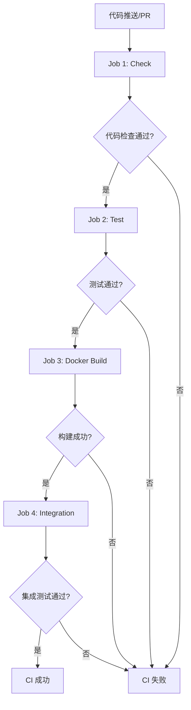

# VoltageEMS CI/CD 工作流程文档

## 📋 概述

VoltageEMS 使用 GitHub Actions 进行持续集成（CI），确保代码质量和功能正确性。

## 🔄 CI 触发条件

- **Push 事件**: 推送到 `main`、`develop`、`feature/*` 分支时触发
- **Pull Request**: 向 `main` 或 `develop` 分支提交 PR 时触发
- **手动触发**: debug.yml 支持手动触发进行问题排查

## 📊 CI 流程图



## 🚀 详细流程

### Job 1: Check（代码质量检查）
**运行环境**: `ubuntu-latest`  
**耗时**: 约 1-2 分钟

1. **检出代码** - 获取最新代码
2. **安装 Rust** - 安装稳定版 Rust 工具链
3. **安装 Protoc** - 安装 Protocol Buffers 编译器
4. **缓存依赖** - 缓存 Cargo 依赖加速后续构建
5. **格式检查** - `cargo fmt --all -- --check`
6. **编译检查** - `cargo check --workspace`
7. **Clippy 分析** - 静态代码分析，检查潜在问题

### Job 2: Test（单元测试）
**运行环境**: `ubuntu-latest` + Redis 服务  
**耗时**: 约 2-3 分钟  
**依赖**: Job 1 成功完成

1. **启动 Redis** - Docker 容器运行 Redis 服务
2. **安装工具** - Rust、Protoc、Redis CLI
3. **加载 Lua 函数** - 将业务逻辑函数加载到 Redis
4. **运行测试** - 执行所有单元测试
5. **服务测试** - 分别测试每个微服务

### Job 3: Docker Build（镜像构建）
**运行环境**: `ubuntu-latest`  
**耗时**: 约 5-8 分钟  
**依赖**: Job 2 成功完成  
**条件**: 仅在 push 事件时运行

并行构建以下服务的 Docker 镜像：
- comsrv（通信服务）
- modsrv（模型服务）
- alarmsrv（告警服务）
- rulesrv（规则引擎）
- hissrv（历史服务）
- apigateway（API 网关）
- netsrv（网络服务）

### Job 4: Integration（集成测试）
**运行环境**: `ubuntu-latest`  
**耗时**: 约 3-5 分钟  
**依赖**: Job 3 成功完成  
**条件**: 仅在推送到 main/develop 分支时运行

1. **启动服务** - 使用 docker-compose 启动所有服务
2. **健康检查** - 验证所有服务正常启动
3. **API 测试** - 测试各服务的基础 API
4. **收集日志** - 保存测试日志供调试使用

## 🛠️ 关键配置

### 环境变量
```bash
CARGO_TERM_COLOR: always    # 彩色输出
RUST_BACKTRACE: 1           # 显示错误堆栈
REDIS_URL: redis://localhost:6379  # Redis 连接
```

### Clippy 忽略规则
```yaml
-A clippy::new_without_default      # 允许无 Default 的 new
-A clippy::uninlined_format_args    # 允许内联格式参数
-A clippy::approx_constant          # 允许近似常量
-A clippy::derivable_impls          # 允许可派生的实现
```

### 缓存策略
- 缓存 `~/.cargo` 目录和 `target/` 目录
- 基于 `Cargo.lock` 文件的哈希值作为缓存键
- 显著加速依赖下载和编译过程

## 📝 本地验证

在推送代码前，可以本地运行以下命令验证：

```bash
# 快速检查（格式、clippy、编译）
./scripts/quick-check.sh

# 完整 CI 验证
./scripts/validate-ci.sh

# 仅运行测试
cargo test --workspace
```

## 🔧 常见问题

### 1. Protoc 未找到
**错误**: `Could not find protoc`  
**解决**: CI 中已添加 `apt-get install protobuf-compiler`

### 2. Redis 连接失败
**错误**: `Connection refused (os error 111)`  
**解决**: 确保 Redis 服务已启动，CI 中通过 services 配置自动启动

### 3. Clippy 警告
**现象**: 代码有 clippy 警告导致 CI 失败  
**解决**: 修复警告或在合理情况下添加忽略规则

### 4. 测试超时
**现象**: 测试运行时间过长  
**解决**: 使用 `--test-threads=1` 避免并发问题

## 📂 相关文件

- `.github/workflows/ci.yml` - 主要 CI 配置
- `.github/workflows/debug.yml` - 调试工作流
- `scripts/quick-check.sh` - 本地快速检查脚本
- `scripts/validate-ci.sh` - 本地 CI 验证脚本

## 🔗 查看 CI 状态

1. 访问 GitHub 仓库
2. 点击 "Actions" 标签
3. 查看工作流运行状态和日志

## 💡 优化建议

1. **并行化**: Docker 构建已并行化，节省时间
2. **缓存**: 充分利用 GitHub Actions 缓存
3. **条件执行**: 集成测试仅在必要时运行
4. **快速失败**: 按依赖顺序执行，尽早发现问题

## 📊 性能指标

| 阶段 | 预期耗时 | 说明 |
|------|---------|------|
| Check | 1-2 分钟 | 代码质量检查 |
| Test | 2-3 分钟 | 单元测试 |
| Docker Build | 5-8 分钟 | 并行构建镜像 |
| Integration | 3-5 分钟 | 集成测试 |
| **总计** | **11-18 分钟** | 完整 CI 流程 |

## 🚦 CI 状态徽章

可以在 README.md 中添加：

```markdown
[](https://github.com/YourOrg/VoltageEMS/actions/workflows/ci.yml)
```

---

*最后更新: 2025-08-07*