# DevOps 概念和工具介绍

## 目录

1. [什么是DevOps](#什么是devops)
2. [DevOps核心实践](#devops核心实践)
3. [DevOps工具链](#devops工具链)
4. [工具详细介绍](#工具详细介绍)
5. [DevOps工作流程](#devops工作流程)
6. [如何开始](#如何开始)

## 什么是DevOps

### 传统开发模式的问题

在传统的软件开发模式中，开发团队和运维团队是分离的：

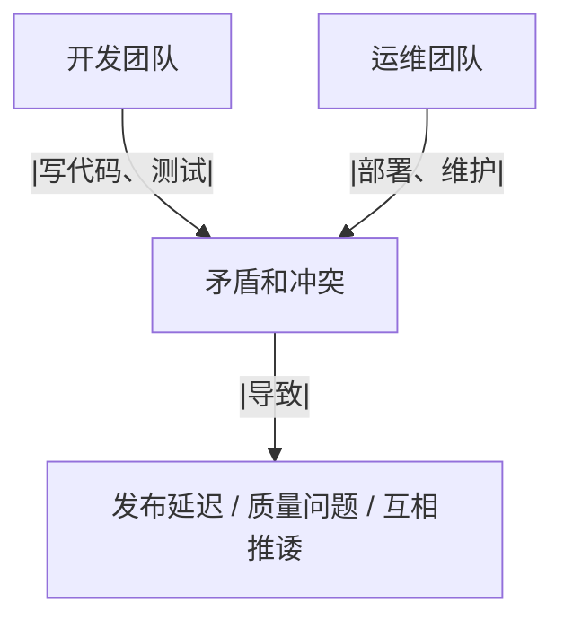

这种模式会导致：

- 开发环境和生产环境不一致
- 部署过程手动且容易出错
- 问题定位困难，互相推诿
- 发布周期长，风险高

### DevOps的解决方案

DevOps = Development（开发）+ Operations（运维）

DevOps不仅是一套工具，更是一种文化和理念：

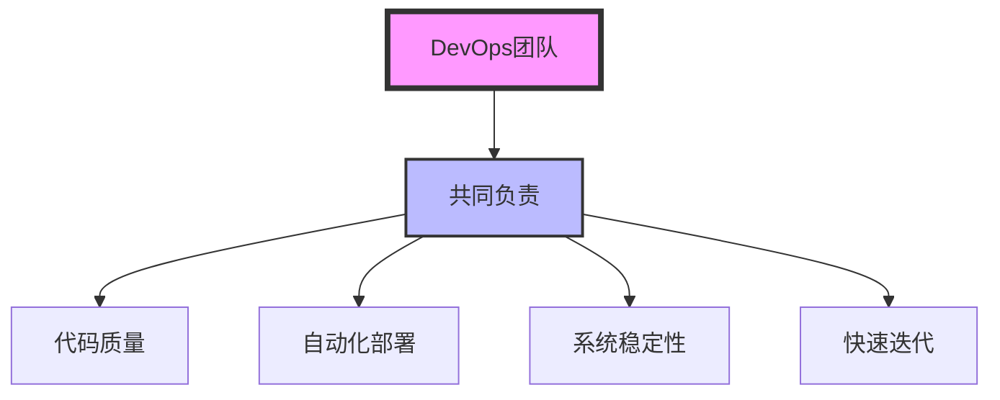

### DevOps的核心价值

1. **更快的交付速度**

   - 自动化流程减少人工操作
   - 小步快跑，频繁发布
2. **更高的软件质量**

   - 自动化测试保证质量
   - 环境一致性减少bug
3. **更好的协作**

   - 开发运维共同负责
   - 问题快速响应和解决
4. **更低的风险**

   - 小批量发布降低风险
   - 快速回滚机制

## DevOps核心实践

### 1. 持续集成（CI - Continuous Integration）

**什么是CI？**
开发人员频繁地（一天多次）将代码集成到主干分支，每次集成都通过自动化构建和测试来验证。

```mermaid
graph LR
    A[开发者A] --> C[Git仓库]
    B[开发者B] --> C
    C --> D[自动构建]
    D --> E[自动测试]
    E --> F[反馈结果]
    F --|成功/失败|-> A
    F --|成功/失败|-> B
```

**CI的好处：**

- 尽早发现集成问题
- 减少集成地狱
- 保持代码始终可部署

### 2. 持续交付/部署（CD - Continuous Delivery/Deployment）

**持续交付 vs 持续部署：**

- **持续交付**：代码随时可以部署到生产，但需要人工批准
- **持续部署**：代码自动部署到生产，无需人工干预

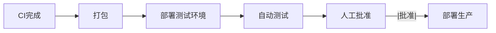

### 3. 基础设施即代码（IaC - Infrastructure as Code）

**传统方式：**

- 手动配置服务器
- 文档记录配置步骤
- 环境不一致

**IaC方式：**

```yaml
# docker-compose.yml - 用代码定义基础设施
version: '3.8'
services:
  web:
    image: nginx
    ports:
      - "80:80"
  database:
    image: postgres
    environment:
      POSTGRES_PASSWORD: secret
```

**好处：**

- 环境一致性
- 版本控制
- 快速复制环境

### 4. 监控和日志

**为什么重要？**

- 及时发现问题
- 快速定位原因
- 数据驱动决策

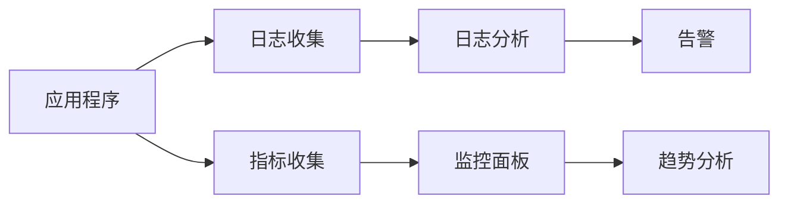

### 5. 自动化测试

**测试金字塔：**

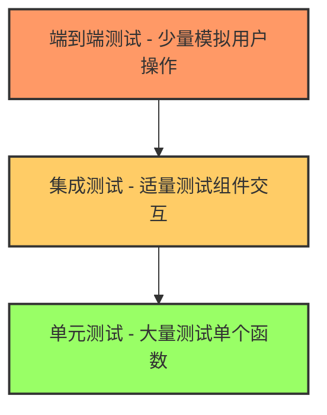

## DevOps工具链

### 完整的DevOps工具链

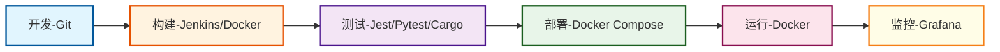

### 主要工具分类

| 类别     | 工具                | 作用                   |
| -------- | ------------------- | ---------------------- |
| 版本控制 | Git                 | 代码版本管理，团队协作 |
| CI/CD    | Jenkins             | 自动化构建、测试、部署 |
| 容器化   | Docker              | 打包应用，保证环境一致 |
| 容器编排 | Docker Compose      | 管理多容器应用         |
| 镜像仓库 | Docker Registry     | 存储和分发Docker镜像   |
| 监控     | Prometheus, Grafana | 系统监控和可视化       |
| 日志     | ELK Stack           | 日志收集、存储、分析   |
| 脚本     | Shell, Python       | 自动化各种任务         |

## 工具详细介绍

### 1. Git - 版本控制系统

**作用：**

- 记录代码变更历史
- 多人协作开发
- 分支管理

**基本概念：**


**常用命令：**

```bash
git clone <仓库地址>        # 克隆仓库
git add .                  # 添加文件到暂存区
git commit -m "描述"       # 提交到本地仓库
git push                   # 推送到远程仓库
git pull                   # 拉取最新代码
```

### 2. Jenkins - CI/CD工具

**什么是Jenkins？**
Jenkins是一个自动化服务器，可以理解为一个"自动化管家"：

- 监控代码仓库的变化
- 自动执行构建、测试、部署任务
- 通知团队任务结果

**Jenkins工作原理：**

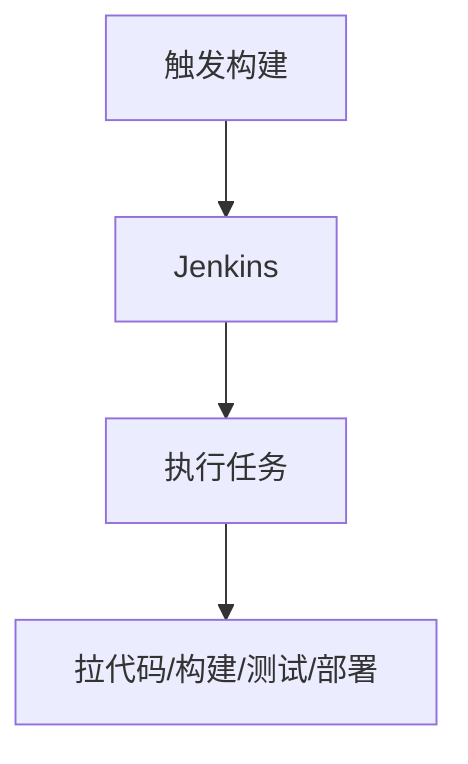

**Pipeline（流水线）：**
Jenkins使用Pipeline来定义整个CI/CD流程：

```groovy
pipeline {
    agent any
    stages {
        stage('构建') {
            steps {
                echo '构建应用...'
            }
        }
        stage('测试') {
            steps {
                echo '运行测试...'
            }
        }
        stage('部署') {
            steps {
                echo '部署到服务器...'
            }
        }
    }
}
```

### 3. Docker - 容器技术

**什么是Docker？**
Docker就像一个"集装箱"，把应用和它需要的所有东西打包在一起：

- 应用程序代码
- 运行环境
- 系统库
- 系统配置

**Docker vs 虚拟机：**

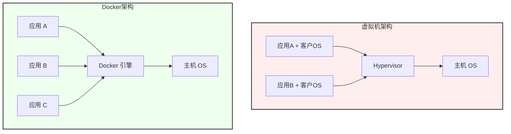

特点对比：

- **虚拟机**：笨重、启动慢（分钟级）
- **Docker**：轻量、启动快（秒级）

**Dockerfile - 构建镜像的配方：**

```dockerfile
FROM node:16          # 基础镜像
WORKDIR /app         # 工作目录
COPY package*.json . # 复制文件
RUN npm install      # 安装依赖
COPY . .            # 复制代码
CMD ["npm", "start"] # 启动命令
```

### 4. Docker Compose - 容器编排工具

**作用：**
管理多个容器的工具，用YAML文件定义多容器应用。

**示例：**

```yaml
version: '3.8'
services:
  web:
    build: .
    ports:
      - "80:80"
    depends_on:
      - db
  db:
    image: mysql:5.7
    environment:
      MYSQL_ROOT_PASSWORD: secret
```

**好处：**

- 一条命令启动整个应用栈
- 服务间依赖自动处理
- 环境变量统一管理

### 5. Docker Registry - 镜像仓库

**作用：**
存储和分发Docker镜像，类似于代码的Git仓库。


**类型：**

- Docker Hub（公共）
- 私有Registry（企业内部）
- 云服务商Registry（阿里云、AWS等）

### 6. 监控工具

**Prometheus：**

- 时序数据库
- 收集系统指标
- 支持告警规则

**Grafana：**

- 数据可视化
- 创建监控面板
- 支持多数据源

**监控架构：**

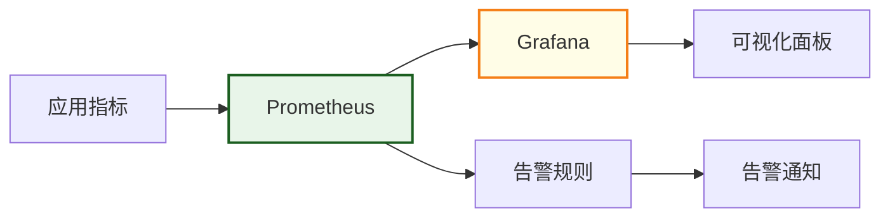

### 7. Shell脚本 - 自动化利器

**作用：**
自动化日常任务，减少重复工作。

**示例脚本：**

```bash
#!/bin/bash
# 部署脚本示例

echo "开始部署..."

# 拉取最新代码
git pull

# 构建Docker镜像
docker build -t myapp:latest .

# 停止旧容器
docker stop myapp || true

# 启动新容器
docker run -d --name myapp -p 80:80 myapp:latest

echo "部署完成！"
```

## DevOps工作流程

### 完整的DevOps流程

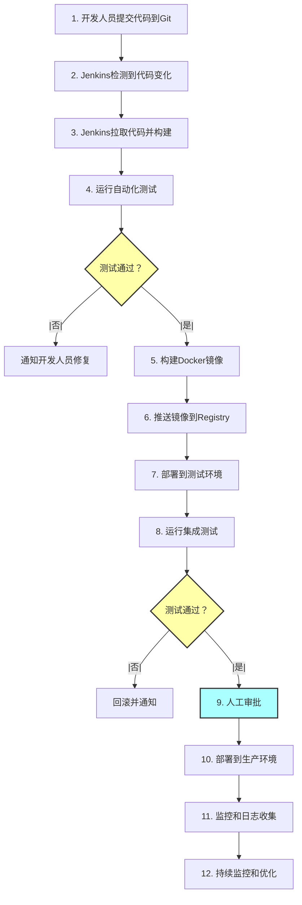

### 反馈循环

DevOps强调快速反馈：

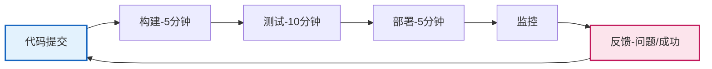

快速反馈的好处：

- 问题早发现早解决
- 减少修复成本
- 提高开发效率

## 如何开始

### 1. 小步开始

不要试图一次性实现所有DevOps实践：

1. 先使用Git进行版本控制
2. 编写自动化测试
3. 使用Docker容器化应用
4. 搭建Jenkins自动化构建
5. 逐步完善监控和日志

### 2. 文化先行

DevOps成功的关键是文化：

- **协作**：打破部门墙
- **责任**：共同为质量负责
- **学习**：持续改进
- **自动化**：减少重复工作

### 3. 选择合适的工具

根据团队规模和需求选择工具：

- 小团队：Jenkins + Docker + 简单脚本
- 中型团队：增加监控和日志工具
- 大型团队：考虑Kubernetes等高级工具

### 4. 持续改进

DevOps是一个持续的过程：

- 定期回顾流程
- 收集团队反馈
- 优化瓶颈环节
- 引入新的实践

## 总结

DevOps不是一蹴而就的，而是一个渐进的过程。关键是：

1. 理解DevOps的理念而不仅是工具
2. 从团队最痛的点开始改进
3. 保持持续学习和改进的心态
4. 记住：工具是为人服务的，不要为了工具而工具

通过实施DevOps，团队可以：

- 更快地交付价值
- 更高的软件质量
- 更好的团队协作
- 更少的运维压力

---

下一步：阅读[VoltageEMS CI/CD架构说明](./VOLTAGEEMS_CICD_ARCHITECTURE.md)了解这些概念在项目中的具体应用。
