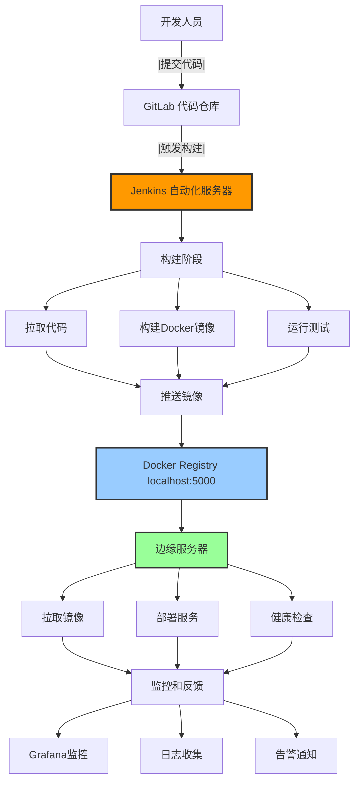
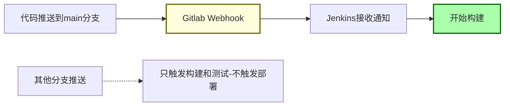
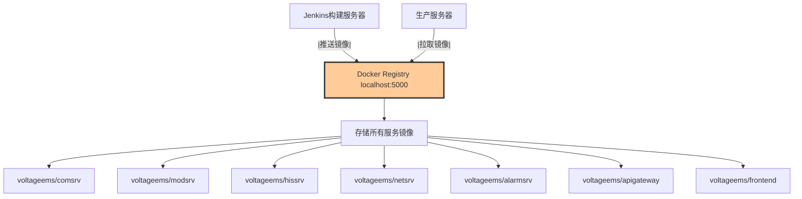
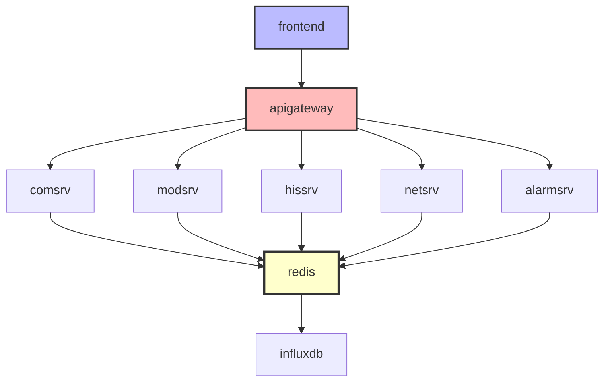
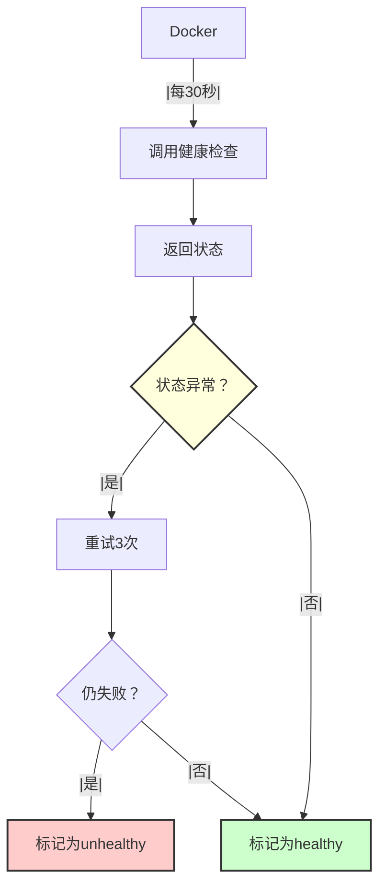
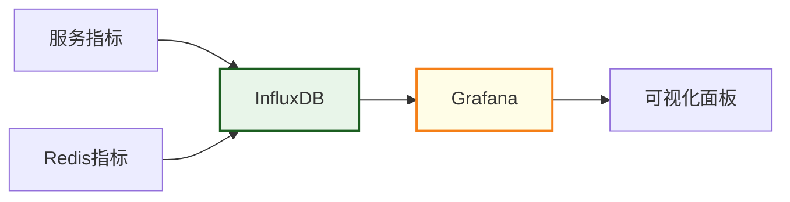
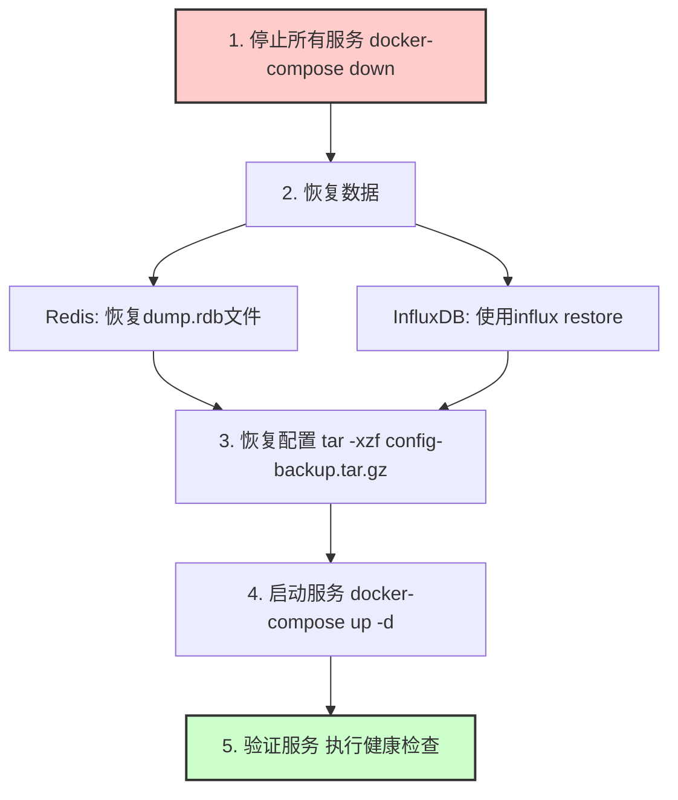
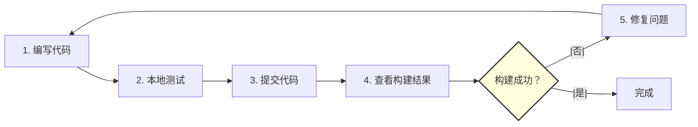
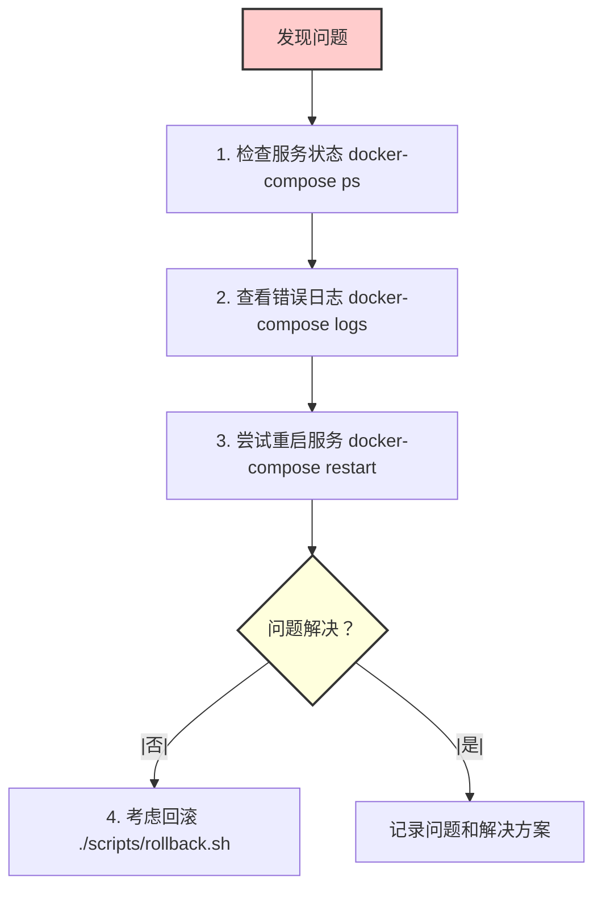

# VoltageEMS CI/CD 架构说明

## 目录

1. [项目CI/CD架构概览](#项目cicd架构概览)
2. [技术栈选择](#技术栈选择)
3. [CI/CD流程详解](#cicd流程详解)
4. [关键组件说明](#关键组件说明)
5. [Jenkinsfile解析](#jenkinsfile解析)
6. [部署架构](#部署架构)
7. [监控和日志](#监控和日志)
8. [安全和备份](#安全和备份)
9. [团队使用指南](#团队使用指南)
10. [常见问题](#常见问题)

## 项目CI/CD架构概览

### 整体架构图



### 数据流向说明

1. **代码流**：开发者 → Git → Jenkins → 构建环境
2. **镜像流**：构建环境 → Docker Registry → 生产服务器
3. **监控流**：生产服务器 → 监控系统 → 开发者

## 技术栈选择

### 为什么选择这些技术？

#### 1. Docker而非虚拟机

- **轻量级**：容器启动只需秒级，虚拟机需要分钟级
- **一致性**：开发、测试、生产环境完全一致
- **资源效率**：边缘服务器资源有限，Docker占用更少

#### 2. Jenkins而非其他CI/CD工具

- **成熟稳定**：企业级应用，久经考验
- **插件丰富**：几乎支持所有工具集成
- **易于上手**：图形界面友好，学习曲线平缓
- **社区支持**：问题容易找到解决方案

#### 3. Docker Compose而非Kubernetes

- **简单直接**：YAML配置文件易懂易维护
- **足够用**：单机或小集群场景下完全够用
- **低overhead**：不需要K8s的复杂控制平面
- **快速部署**：一条命令启动所有服务

#### 4. 本地Registry而非云服务

- **网络要求低**：边缘服务器可能网络受限
- **速度快**：本地拉取镜像速度更快
- **成本低**：不需要额外的云服务费用
- **安全性**：镜像不离开本地网络

### 技术栈对比

| 需求     | 我们的选择       | 替代方案                  | 选择理由               |
| -------- | ---------------- | ------------------------- | ---------------------- |
| 容器化   | Docker           | Podman, LXC               | 生态最完善，工具链齐全 |
| CI/CD    | Jenkins          | GitLab CI, GitHub Actions | 功能强大，本地部署方便 |
| 容器编排 | Docker Compose   | Kubernetes, Swarm         | 简单够用，学习成本低   |
| 镜像仓库 | Local Registry   | Harbor, Nexus             | 轻量简单，满足需求     |
| 监控     | Grafana+InfluxDB | Prometheus+Grafana        | InfluxDB更适合时序数据 |

## CI/CD流程详解

### 触发机制



### 完整流程步骤

#### 1. 准备阶段 (Preparation)

```bash
# Jenkins执行内容
- 打印构建信息（版本号、分支、提交ID）
- 检查Docker环境
- 检查Docker Compose版本
- 设置环境变量
```

#### 2. 构建阶段 (Build)

```bash
# 调用 build-all.sh 脚本
- 构建7个Rust服务的Docker镜像
  • comsrv (通信服务)
  • modsrv (模型服务)
  • hissrv (历史数据服务)
  • netsrv (网络服务)
  • alarmsrv (告警服务)
  • apigateway (API网关)
  • config-framework (配置服务)
- 构建前端Vue.js应用镜像
- 为每个镜像打标签（版本号和latest）
```

#### 3. 测试阶段 (Test)

并行执行两种测试：

**单元测试：**

```bash
# 在容器中运行Rust测试
docker run --rm ${REGISTRY}/${PROJECT}/comsrv:${VERSION} cargo test
```

**集成测试：**

```bash
# 启动测试环境
docker-compose -f docker-compose.test.yml up -d
# 运行集成测试脚本
./scripts/run-integration-tests.sh
# 清理测试环境
docker-compose -f docker-compose.test.yml down
```

#### 4. 推送阶段 (Push)

```bash
# 推送所有镜像到本地Registry
for service in comsrv modsrv hissrv netsrv alarmsrv apigateway frontend; do
    docker push ${REGISTRY}/${PROJECT}/${service}:${VERSION}
    docker push ${REGISTRY}/${PROJECT}/${service}:latest
done
```

#### 5. 部署阶段 (Deploy)

```bash
# 只在main分支触发
if (branch == 'main') {
    ./scripts/deploy.sh production ${VERSION}
}
```

## 关键组件说明

### 1. Git仓库结构

```
VoltageEMS/
├── services/           # 微服务源代码
│   ├── comsrv/
│   ├── modsrv/
│   └── ...
├── frontend/          # 前端代码
├── scripts/           # CI/CD脚本
│   ├── build-all.sh
│   ├── deploy.sh
│   └── rollback.sh
├── docker-compose.prod.yml    # 生产环境配置
├── docker-compose.test.yml    # 测试环境配置
├── Jenkinsfile               # Pipeline定义
└── config/                   # 配置文件
```

### 2. 核心脚本详解

#### build-all.sh - 构建脚本

```bash
#!/bin/bash
# 功能：批量构建所有服务的Docker镜像

主要步骤：
1. 设置版本号和Registry地址
2. 遍历所有服务目录
3. 检查是否有Dockerfile
4. 如果没有，自动生成通用Dockerfile
5. 执行docker build命令
6. 为镜像打标签（版本号和latest）
7. 显示构建结果
```

#### deploy.sh - 部署脚本

```bash
#!/bin/bash
# 功能：智能部署到目标环境

主要步骤：
1. 检查运行权限（需要sudo）
2. 创建必要目录（部署目录、备份目录、日志目录）
3. 备份当前部署（如果存在）
4. 复制docker-compose.prod.yml到部署目录
5. 更新镜像版本
6. 拉取新镜像
7. 停止旧容器
8. 启动新容器
9. 执行健康检查
10. 如果失败，询问是否回滚
```

#### rollback.sh - 回滚脚本

```bash
#!/bin/bash
# 功能：快速回滚到之前版本

主要步骤：
1. 列出所有可用备份
2. 让用户选择要回滚的版本
3. 确认回滚操作
4. 停止当前服务
5. 恢复备份的配置文件
6. 启动服务
7. 执行健康检查
8. 记录回滚信息
```

### 3. Docker Registry

本地Registry架构：



### 4. 环境配置

环境变量（在Jenkinsfile中定义）：

```groovy
environment {
    VERSION = "${env.BUILD_NUMBER}-${env.GIT_COMMIT.take(7)}"  // 版本号
    REGISTRY = "localhost:5000"                                 // Registry地址
    PROJECT = "voltageems"                                      // 项目名
}
```

## Jenkinsfile解析

### Pipeline结构

```groovy
pipeline {
    agent any                    // 在任何可用节点上运行
  
    environment { ... }          // 环境变量定义
  
    stages {                     // 阶段定义
        stage('准备') { ... }
        stage('构建') { ... }
        stage('测试') { ... }
        stage('推送镜像') { ... }
        stage('部署') { ... }
    }
  
    post {                       // 构建后操作
        success { ... }          // 成功时
        failure { ... }          // 失败时
        always { ... }           // 总是执行
    }
}
```

### 关键配置说明

#### 1. 版本号生成

```groovy
VERSION = "${env.BUILD_NUMBER}-${env.GIT_COMMIT.take(7)}"
// 示例：23-a3b4c5d
// 23 是构建号，a3b4c5d 是Git提交ID的前7位
```

#### 2. 并行测试

```groovy
parallel {
    stage('单元测试') { ... }
    stage('集成测试') { ... }
}
// 两种测试同时运行，节省时间
```

#### 3. 条件部署

```groovy
when {
    branch 'main'  // 只有main分支才部署到生产
}
```

#### 4. 错误处理

```groovy
post {
    failure {
        sh 'docker-compose -f docker-compose.test.yml down || true'
        // 即使清理失败也不影响整体流程
    }
}
```

## 部署架构

### Docker Compose生产配置

```yaml
# docker-compose.prod.yml 结构
version: '3.8'

services:
  # 数据层
  redis:          # 实时数据总线
  influxdb:       # 时序数据库
  
  # 业务服务层
  comsrv:         # 通信服务
  modsrv:         # 模型服务
  hissrv:         # 历史数据服务
  netsrv:         # 网络服务
  alarmsrv:       # 告警服务
  
  # 接入层
  apigateway:     # API网关
  frontend:       # Web前端
  
  # 监控层（可选）
  grafana:        # 监控面板

networks:
  default:
    name: voltageems_network

volumes:
  redis_data:     # Redis数据持久化
  influxdb_data:  # InfluxDB数据持久化
  ...
```

### 服务依赖关系



### 数据持久化策略

1. **Redis数据**

   - 使用AOF持久化
   - 定期备份RDB文件
   - 挂载到宿主机目录
2. **InfluxDB数据**

   - 时序数据自动压缩
   - 设置数据保留策略
   - 定期备份到外部存储
3. **日志数据**

   - 每个服务独立日志卷
   - 日志轮转防止占满磁盘
   - 可选：集中到日志服务器

## 监控和日志

### 健康检查机制

每个服务都配置了健康检查：

```yaml
healthcheck:
  test: ["CMD", "curl", "-f", "http://localhost:8080/health"]
  interval: 30s      # 检查间隔
  timeout: 10s       # 超时时间
  retries: 3         # 重试次数
```

健康检查流程：



### 日志收集方案


查看日志命令：

```bash
# 实时查看所有服务日志
docker-compose logs -f

# 查看特定服务最近100行
docker-compose logs --tail=100 comsrv

# 查看特定时间段日志
docker-compose logs --since 2024-01-01T10:00:00
```

### Grafana监控配置

监控架构：



预配置的监控面板：

1. **系统概览**：CPU、内存、网络
2. **服务状态**：各服务健康状态
3. **业务指标**：请求量、响应时间
4. **告警面板**：异常事件汇总

## 安全和备份

### 安全措施

1. **镜像安全**

   - 使用官方基础镜像
   - 定期更新基础镜像
   - 最小化镜像（只包含必要组件）
2. **网络安全**

   - 使用Docker网络隔离
   - 只暴露必要端口
   - 生产环境配置防火墙规则
3. **配置安全**

   - 敏感信息使用环境变量
   - 密码等敏感数据加密存储
   - 定期更换密码和token

### 备份策略

自动备份机制（在deploy.sh中实现）：


手动备份：

```bash
# 备份数据
docker exec voltageems_redis redis-cli BGSAVE
docker exec voltageems_influxdb influx backup /backup

# 备份配置
tar -czf config-backup-$(date +%Y%m%d).tar.gz /opt/voltageems/config
```

### 灾难恢复

恢复流程：



## 团队使用指南

### 开发人员

#### 日常工作流程



#### 如何查看构建结果

1. **Jenkins界面**

   - 访问 http://jenkins.company.com
   - 查看项目的构建历史
   - 点击构建号查看详细日志
2. **构建状态**

   - 🟢 绿色：构建成功
   - 🔴 红色：构建失败
   - 🟡 黄色：构建不稳定（测试部分失败）
3. **失败处理**

   ```mermaid
   flowchart TD
       A[构建失败？] --> B[查看Console Output]
       B --> C[定位失败阶段]
       C --> D[查看具体错误信息]
       D --> E[本地复现并修复]

       style A fill:#fcc,stroke:#333,stroke-width:2px
   ```

### 运维人员

#### 部署管理

1. **查看部署状态**

   ```bash
   cd /opt/voltageems
   docker-compose ps
   ```
2. **查看服务日志**

   ```bash
   docker-compose logs -f [服务名]
   ```
3. **手动部署**（紧急情况）

   ```bash
   sudo ./scripts/deploy.sh production [版本号]
   ```

#### 故障处理流程



### 项目经理

#### 发布管理

1. **查看发布进度**

   - Jenkins构建历史
   - 部署日志
   - 服务运行状态
2. **发布决策**

   - 所有测试通过？
   - 关键功能正常？
   - 性能指标达标？
   - 安全扫描通过？
3. **发布通知模板**

   ```
   发布通知：VoltageEMS v1.2.3

   发布时间：2024-01-15 22:00
   发布内容：
   - 新增：MQTT协议支持
   - 优化：查询性能提升30%
   - 修复：连接断开问题

   影响范围：所有服务重启，预计5分钟
   回滚方案：如有问题，可在10分钟内回滚
   ```

## 常见问题

### Q1: 构建失败，提示"Docker daemon not running"

**A:** 检查Docker服务状态

```bash
sudo systemctl status docker
sudo systemctl start docker
```

### Q2: 部署失败，提示端口已被占用

**A:** 查找并停止占用端口的进程

```bash
sudo lsof -i :8080
sudo kill -9 [PID]
# 或者修改docker-compose.yml中的端口映射
```

### Q3: 镜像推送失败，提示"connection refused"

**A:** 检查Registry是否运行

```bash
docker ps | grep registry
# 如果没有运行，启动Registry
docker run -d -p 5000:5000 --name registry registry:2
```

### Q4: 服务启动后立即退出

**A:** 查看详细日志

```bash
docker-compose logs [服务名]
# 常见原因：
# - 配置文件错误
# - 依赖服务未启动
# - 端口冲突
```

### Q5: 如何加快构建速度？

**A:** 优化策略：

1. 使用Docker构建缓存
2. 优化Dockerfile（把不常变的步骤放前面）
3. 使用本地镜像仓库镜像加速
4. 并行构建不相关的服务

### Q6: 生产环境磁盘空间不足

**A:** 清理策略：

```bash
# 清理未使用的镜像
docker image prune -a

# 清理停止的容器
docker container prune

# 清理未使用的卷
docker volume prune

# 清理构建缓存
docker builder prune
```

### Q7: 如何添加新服务到CI/CD流程？

**A:** 步骤：

1. 在services/目录下创建新服务
2. 编写Dockerfile
3. 在build-all.sh中添加服务名
4. 在docker-compose.prod.yml中添加服务配置
5. 更新Jenkinsfile中的服务列表

### Q8: 如何实现零停机部署？

**A:** 使用滚动更新策略：

1. 先部署新版本到部分节点
2. 健康检查通过后切换流量
3. 停止旧版本
4. 如需要支持真正的零停机，考虑使用Nginx做负载均衡

## 总结

VoltageEMS的CI/CD架构设计原则：

1. **简单可靠**：使用成熟的工具，避免过度设计
2. **自动化**：减少人工操作，降低出错概率
3. **可追溯**：完整的日志和备份，便于问题排查
4. **快速反馈**：10-15分钟完成整个流程
5. **易于维护**：清晰的脚本和文档，便于团队接手

通过这套CI/CD系统，我们实现了：

- ✅ 代码质量保证（自动化测试）
- ✅ 环境一致性（Docker容器化）
- ✅ 快速可靠的部署（自动化脚本）
- ✅ 故障快速恢复（备份和回滚）
- ✅ 团队协作效率（清晰的流程）

记住：CI/CD不是目的，而是手段。目的是让团队能够：

- 更快地交付价值
- 更少地出现问题
- 更轻松地工作

---

相关文档：

- [DevOps概念和工具介绍](./DEVOPS_INTRODUCTION.md)
- [Docker CI/CD指南](./DOCKER_CICD_GUIDE.md)
- [Jenkins实战指南]（待编写）
