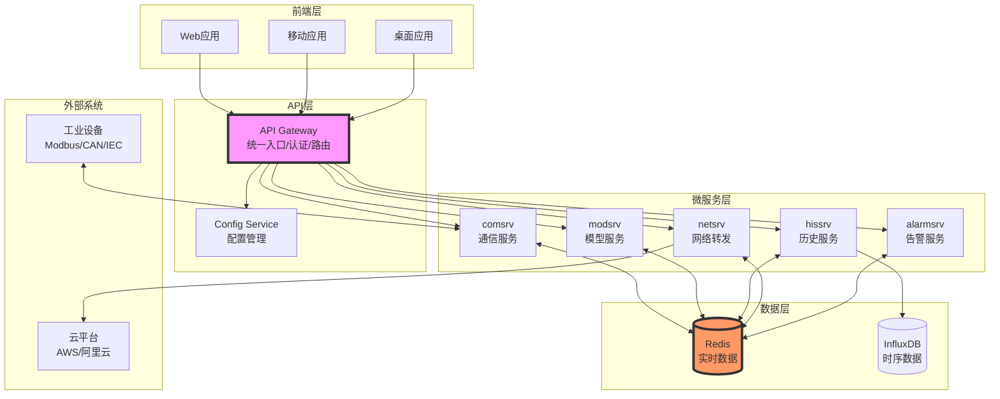
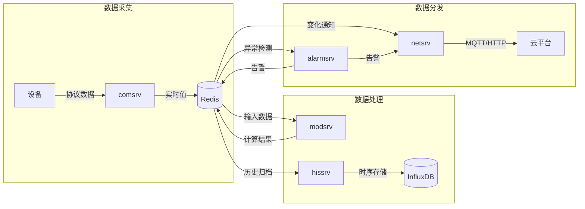
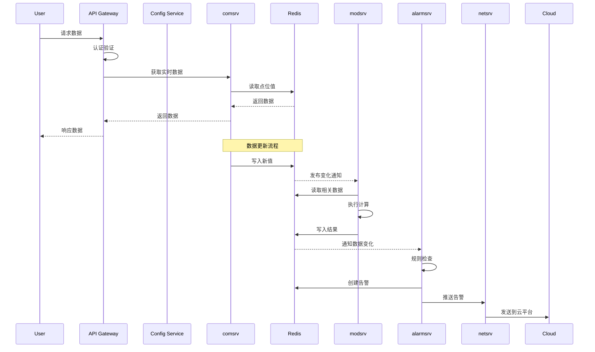
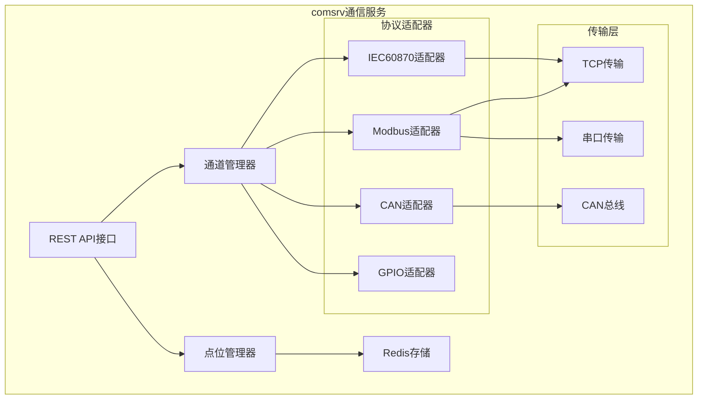
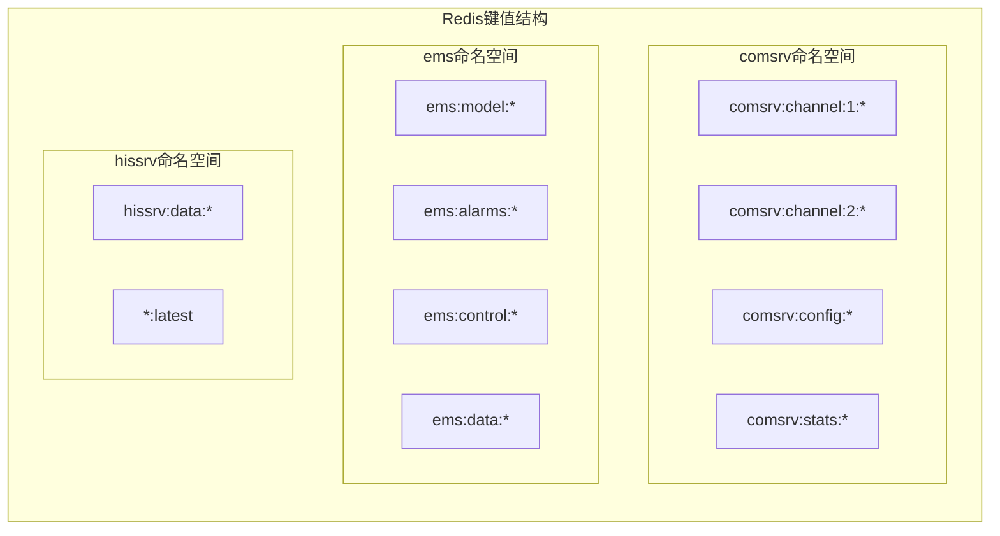
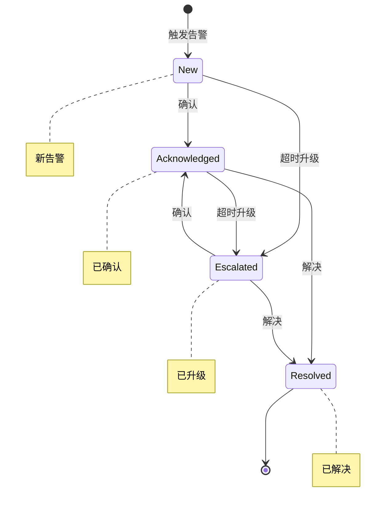
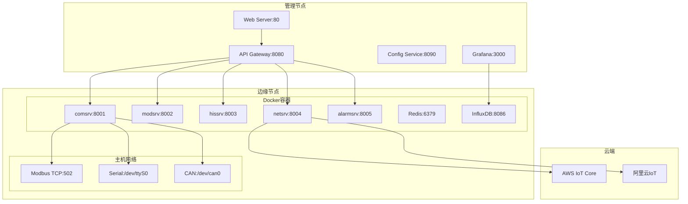
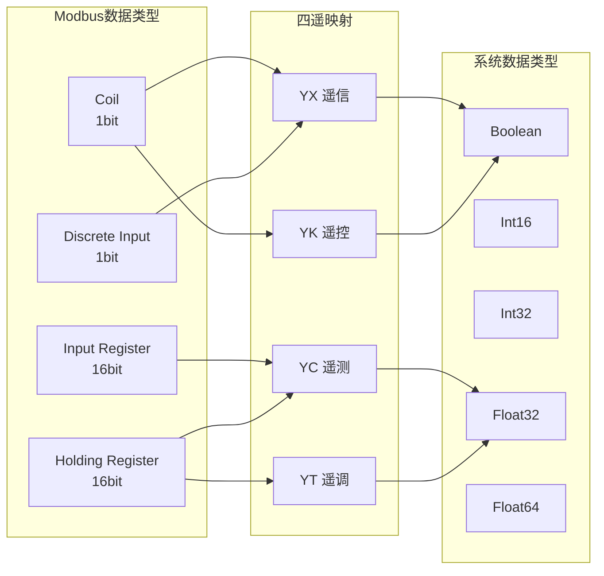

# VoltageEMS 数据结构与API设计文档

## 系统架构

### 整体架构图



### 数据流向图



### 服务交互时序图



### comsrv内部架构



### Redis数据模型



### 告警处理流程



### 部署架构图



### 数据类型映射关系



## 1. 通用数据结构定义

### 1.1 基础数据类型

#### 点位值（PointValue）
```json
{
  "raw": 123.45,          // 原始值
  "processed": 246.9,     // 处理后的值（应用scale和offset后）
  "timestamp": "2024-01-15T10:30:00Z",  // ISO 8601时间戳
  "quality": "good"       // 数据质量：good/bad/uncertain
}
```

#### 四遥类型（TelemetryType）
- `YC` - 遥测（Telemetry）：模拟量测量值
- `YX` - 遥信（Signaling）：开关量状态
- `YK` - 遥控（Control）：开关控制命令
- `YT` - 遥调（Regulation）：模拟量设定值

## 2. 各服务数据结构

### 2.1 comsrv - 通信服务

#### 通道配置（ChannelConfig）
```json
{
  "id": 1,
  "name": "ModbusTCP测试通道",
  "description": "连接到本地Modbus设备",
  "protocol": "modbus_tcp",
  "enabled": true,
  "parameters": {
    // 本机可控参数
    "host": "192.168.1.100",    // 目标IP地址
    "port": 502,                 // 目标端口
    "timeout": 3000,             // 超时时间(ms)
    "retry_count": 3,            // 重试次数
    "retry_interval": 1000       // 重试间隔(ms)
  },
  "logging": {
    "enabled": true,
    "level": "debug",
    "log_dir": "logs/modbus_tcp_01"
  }
}
```

#### 点位配置（PointConfig）
```json
{
  "point_id": 10001,
  "name": "电压A相",
  "description": "A相电压测量值",
  "telemetry_type": "YC",
  "data_type": "float",
  "unit": "V",
  "scale": 0.1,
  "offset": 0,
  "reverse": false,
  "enabled": true,
  "readable": true,
  "writable": false,
  "protocol_mapping": {
    "slave_id": 1,           // Modbus从站地址
    "function_code": 3,      // 功能码
    "register": 100,         // 寄存器地址
    "data_format": "float32" // 数据格式
  }
}
```

#### Redis存储格式
```
键：comsrv:channel:1:voltage_a
值：{
  "raw": 2200,
  "processed": 220.0,
  "timestamp": "2024-01-15T10:30:00Z",
  "quality": "good"
}
```

### 2.2 modsrv - 模型服务

#### 模型定义（ModelDefinition）
```json
{
  "id": "model_001",
  "name": "功率计算模型",
  "description": "根据电压电流计算功率",
  "enabled": true,
  "inputs": [
    {
      "name": "voltage",
      "source_key": "comsrv:channel:1:voltage_a",
      "field": "processed"
    },
    {
      "name": "current", 
      "source_key": "comsrv:channel:1:current_a",
      "field": "processed"
    }
  ],
  "calculation": "voltage * current * 0.001",  // kW
  "output": {
    "key": "ems:model:output:power_a",
    "unit": "kW"
  }
}
```

#### DAG规则（DagRule）
```json
{
  "id": "rule_001",
  "name": "过载保护规则",
  "enabled": true,
  "nodes": [
    {
      "id": "input_1",
      "type": "input",
      "config": {
        "source": "ems:model:output:power_a"
      }
    },
    {
      "id": "condition_1",
      "type": "condition",
      "config": {
        "expression": "value > 100"
      }
    },
    {
      "id": "action_1",
      "type": "action",
      "config": {
        "type": "remote_control",
        "channel": "modbus_channel_1",
        "point": "breaker_control",
        "value": 0
      }
    }
  ],
  "edges": [
    {"from": "input_1", "to": "condition_1"},
    {"from": "condition_1", "to": "action_1", "condition": "true"}
  ]
}
```

### 2.3 hissrv - 历史数据服务

#### 数据点（DataPoint）
```json
{
  "key": "voltage_a",
  "timestamp": "2024-01-15T10:30:00Z",
  "value": 220.5,
  "tags": {
    "channel": "modbus_01",
    "device": "meter_01",
    "phase": "A"
  },
  "metadata": {
    "unit": "V",
    "quality": "good"
  }
}
```

#### InfluxDB存储结构
```
测量名：hissrv_data
标签：
  - key: voltage_a
  - channel: modbus_01
  - device: meter_01
  - phase: A
字段：
  - float_value: 220.5
  - quality: "good"
时间：2024-01-15T10:30:00Z
```

### 2.4 netsrv - 网络转发服务

#### 网络配置（NetworkConfig）
```json
{
  "id": "net_001",
  "name": "AWS IoT转发",
  "type": "cloud_mqtt",
  "enabled": true,
  "config": {
    "platform": "aws",
    "region": "cn-northwest-1",
    "endpoint": "xxx.iot.cn-northwest-1.amazonaws.com.cn",
    "client_id": "voltage_ems_001",
    "thing_name": "voltage_ems_device",
    "auth": {
      "type": "x509",
      "cert_path": "/certs/device.crt",
      "key_path": "/certs/device.key",
      "ca_path": "/certs/ca.pem"
    },
    "topics": {
      "telemetry": "dt/voltage_ems/telemetry",
      "command": "cmd/voltage_ems/control"
    }
  },
  "data_sources": [
    "comsrv:channel:*",
    "ems:model:output:*",
    "ems:alarms:*"
  ]
}
```

### 2.5 alarmsrv - 告警服务

#### 告警定义（Alarm）
```json
{
  "id": "550e8400-e29b-41d4-a716-446655440000",
  "title": "A相电压过高",
  "description": "A相电压超过额定值的110%",
  "level": "major",        // critical/major/minor/warning/info
  "status": "new",         // new/acknowledged/resolved
  "category": "power_quality",
  "priority": 75,
  "tags": ["voltage", "phase_a", "overvoltage"],
  "source": {
    "channel": "modbus_01",
    "point": "voltage_a",
    "value": 242.0,
    "threshold": 231.0
  },
  "timestamps": {
    "created": "2024-01-15T10:30:00Z",
    "updated": "2024-01-15T10:30:00Z",
    "acknowledged": null,
    "resolved": null
  },
  "operators": {
    "acknowledged_by": null,
    "resolved_by": null
  }
}
```

## 3. API设计

### 3.1 API Gateway

基础URL: `http://localhost:8080/api/v1`

#### 认证
所有API请求需要在Header中包含：
```
Authorization: Bearer <token>
```

### 3.2 Config Service API

#### 获取系统配置
```
GET /api/v1/config/system
```

响应：
```json
{
  "services": {
    "comsrv": {
      "enabled": true,
      "host": "localhost",
      "port": 8001
    },
    "modsrv": {
      "enabled": true,
      "host": "localhost", 
      "port": 8002
    }
    // ...
  },
  "redis": {
    "host": "localhost",
    "port": 6379
  }
}
```

#### 更新服务配置
```
PUT /api/v1/config/service/{service_name}
Content-Type: application/json

{
  "enabled": true,
  "parameters": {
    // 服务特定参数
  }
}
```

### 3.3 comsrv API

#### 获取所有通道
```
GET /api/v1/comsrv/channels
```

响应：
```json
{
  "channels": [
    {
      "id": 1,
      "name": "ModbusTCP测试通道",
      "protocol": "modbus_tcp",
      "enabled": true,
      "status": "connected",
      "statistics": {
        "messages_sent": 1000,
        "messages_received": 998,
        "errors": 2,
        "uptime": 3600
      }
    }
  ]
}
```

#### 创建通道
```
POST /api/v1/comsrv/channels
Content-Type: application/json

{
  "name": "新Modbus通道",
  "protocol": "modbus_tcp",
  "parameters": {
    "host": "192.168.1.101",
    "port": 502
  }
}
```

#### 获取点位数据
```
GET /api/v1/comsrv/points?channel_id=1&type=YC
```

响应：
```json
{
  "points": [
    {
      "point_id": 10001,
      "name": "电压A相",
      "value": {
        "raw": 2200,
        "processed": 220.0,
        "timestamp": "2024-01-15T10:30:00Z",
        "quality": "good"
      },
      "unit": "V"
    }
  ]
}
```

#### 执行遥控命令
```
POST /api/v1/comsrv/control
Content-Type: application/json

{
  "channel_id": 1,
  "point_name": "breaker_control",
  "value": 1,
  "operator": "user123",
  "reason": "手动合闸"
}
```

### 3.4 modsrv API

#### 获取所有模型
```
GET /api/v1/modsrv/models
```

#### 创建模型
```
POST /api/v1/modsrv/models
Content-Type: application/json

{
  "name": "新计算模型",
  "inputs": [...],
  "calculation": "...",
  "output": {...}
}
```

#### 获取模型输出
```
GET /api/v1/modsrv/models/{model_id}/output
```

#### 执行模型
```
POST /api/v1/modsrv/models/{model_id}/execute
```

### 3.5 hissrv API

#### 查询历史数据
```
GET /api/v1/hissrv/query?key=voltage_a&start=2024-01-15T00:00:00Z&end=2024-01-15T23:59:59Z&interval=1m
```

响应：
```json
{
  "data": [
    {
      "timestamp": "2024-01-15T00:00:00Z",
      "value": 220.1
    },
    {
      "timestamp": "2024-01-15T00:01:00Z", 
      "value": 220.3
    }
    // ...
  ],
  "statistics": {
    "count": 1440,
    "min": 218.5,
    "max": 221.8,
    "avg": 220.0
  }
}
```

#### 聚合查询
```
GET /api/v1/hissrv/aggregate?keys=voltage_a,voltage_b,voltage_c&function=avg&interval=1h
```

### 3.6 netsrv API

#### 获取网络配置
```
GET /api/v1/netsrv/networks
```

#### 更新网络配置
```
PUT /api/v1/netsrv/networks/{network_id}
```

#### 获取传输统计
```
GET /api/v1/netsrv/statistics
```

响应：
```json
{
  "networks": [
    {
      "id": "net_001",
      "name": "AWS IoT转发",
      "status": "connected",
      "statistics": {
        "messages_sent": 10000,
        "messages_failed": 5,
        "bytes_sent": 1048576,
        "last_send_time": "2024-01-15T10:30:00Z"
      }
    }
  ]
}
```

### 3.7 alarmsrv API

#### 获取告警列表
```
GET /api/v1/alarmsrv/alarms?status=new&level=major&limit=20&offset=0
```

响应：
```json
{
  "alarms": [...],
  "pagination": {
    "total": 100,
    "offset": 0,
    "limit": 20
  }
}
```

#### 确认告警
```
POST /api/v1/alarmsrv/alarms/{alarm_id}/acknowledge
Content-Type: application/json

{
  "operator": "user123",
  "comment": "已通知维护人员"
}
```

#### 解决告警
```
POST /api/v1/alarmsrv/alarms/{alarm_id}/resolve
Content-Type: application/json

{
  "operator": "user123",
  "resolution": "更换故障设备",
  "root_cause": "设备老化"
}
```

#### 获取告警统计
```
GET /api/v1/alarmsrv/statistics?period=today
```

响应：
```json
{
  "total": 150,
  "by_status": {
    "new": 10,
    "acknowledged": 5,
    "resolved": 135
  },
  "by_level": {
    "critical": 2,
    "major": 8,
    "minor": 20,
    "warning": 50,
    "info": 70
  },
  "by_category": {
    "power_quality": 30,
    "communication": 15,
    "device_fault": 25,
    "threshold": 80
  },
  "trends": {
    "today": 15,
    "yesterday": 20,
    "this_week": 100,
    "last_week": 120
  }
}
```

## 4. 通用响应格式

### 成功响应
```json
{
  "success": true,
  "data": {
    // 实际数据
  },
  "timestamp": "2024-01-15T10:30:00Z"
}
```

### 错误响应
```json
{
  "success": false,
  "error": {
    "code": "CHANNEL_NOT_FOUND",
    "message": "通道不存在",
    "details": "Channel with id 999 does not exist"
  },
  "timestamp": "2024-01-15T10:30:00Z"
}
```

### 错误代码
- `400` - 请求参数错误
- `401` - 未授权
- `403` - 禁止访问
- `404` - 资源不存在
- `409` - 资源冲突
- `500` - 服务器内部错误
- `503` - 服务不可用

## 5. WebSocket实时数据推送

### 连接端点
```
ws://localhost:8080/api/v1/ws
```

### 订阅消息格式
```json
{
  "action": "subscribe",
  "topics": [
    "points.channel.1.*",
    "alarms.new",
    "models.output.*"
  ]
}
```

### 数据推送格式
```json
{
  "topic": "points.channel.1.voltage_a",
  "data": {
    "value": 220.5,
    "timestamp": "2024-01-15T10:30:00Z"
  }
}
```

## 6. 批量操作API

### 批量读取点位
```
POST /api/v1/comsrv/points/batch-read
Content-Type: application/json

{
  "points": [
    {"channel_id": 1, "point_id": 10001},
    {"channel_id": 1, "point_id": 10002},
    {"channel_id": 2, "point_id": 20001}
  ]
}
```

### 批量写入控制
```
POST /api/v1/comsrv/control/batch
Content-Type: application/json

{
  "commands": [
    {
      "channel_id": 1,
      "point_name": "breaker_1",
      "value": 1
    },
    {
      "channel_id": 1, 
      "point_name": "breaker_2",
      "value": 0
    }
  ],
  "operator": "user123",
  "reason": "批量操作测试"
}
```