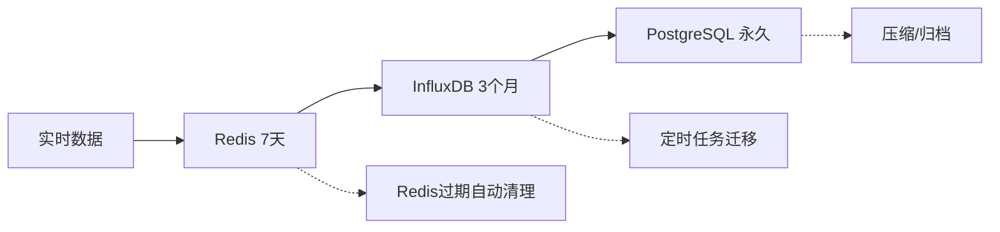

# HisSrv 大数据存储架构设计

## 🎯 设计目标

- **性能**: 快速查询响应 (< 2秒)
- **成本**: 合理的存储成本
- **扩展性**: 支持数据量持续增长
- **可靠性**: 数据不丢失，高可用

## 🏗️ 分层存储架构

### 1. 热数据层 (Redis) - 最近7天
```
用途: 实时查询、dashboard展示
容量: ~100GB
保留: 7天
查询: 毫秒级响应
```

### 2. 温数据层 (InfluxDB) - 最近3个月  
```
用途: 常用历史查询、报表
容量: ~1TB
保留: 3个月
查询: 秒级响应
```

### 3. 冷数据层 (PostgreSQL + 文件存储) - 长期归档
```
用途: 长期存储、合规性要求
容量: 无限制
保留: 永久/按政策
查询: 分钟级响应（预聚合）
```

## 📈 数据生命周期管理



### 自动数据迁移策略

#### 1. 热->温 迁移 (每日凌晨)
```yaml
schedule: "0 2 * * *"  # 每天凌晨2点
action: |
  1. 查询Redis中7天前的数据
  2. 批量写入InfluxDB
  3. 从Redis中删除
  4. 验证数据完整性
```

#### 2. 温->冷 迁移 (每周执行)
```yaml
schedule: "0 3 * * 0"  # 每周日凌晨3点
action: |
  1. 聚合InfluxDB中3个月前的数据
  2. 写入PostgreSQL (已聚合)
  3. 原始数据归档到文件存储
  4. 从InfluxDB中删除原始数据
```

## 🔍 智能查询路由

### 查询路由策略
```rust
pub async fn route_query(filter: &HistoryQueryFilter) -> QueryPlan {
    let now = Utc::now();
    let duration = filter.end_time - filter.start_time;
    
    match (filter.start_time, duration) {
        // 最近7天的数据 -> Redis
        _ if filter.start_time > now - Duration::days(7) => {
            QueryPlan::Redis {
                fast_path: true,
                expected_response_time: "< 100ms"
            }
        },
        
        // 最近3个月的数据 -> InfluxDB
        _ if filter.start_time > now - Duration::days(90) => {
            QueryPlan::InfluxDB {
                use_downsampling: duration > Duration::days(7),
                expected_response_time: "< 2s"
            }
        },
        
        // 更老的数据 -> PostgreSQL (预聚合)
        _ => {
            QueryPlan::PostgreSQL {
                force_aggregation: true,
                max_raw_data_days: 1,
                expected_response_time: "< 30s"
            }
        }
    }
}
```

## 💾 存储层详细设计

### 1. Redis 热数据层

#### 数据结构设计
```redis
# 原始数据点 (保留7天)
hissrv:raw:{source_id}:{point_name}:{date} -> ZSET(timestamp, json_data)

# 分钟级聚合 (保留7天)  
hissrv:agg:1m:{source_id}:{point_name}:{date} -> ZSET(timestamp, avg_value)

# 小时级聚合 (保留30天)
hissrv:agg:1h:{source_id}:{point_name}:{date} -> ZSET(timestamp, avg_value)
```

#### 内存优化策略
```yaml
memory_policy: "allkeys-lru"
max_memory: "8GB"
compression: true
expire_strategy: "ttl_based"  # 自动过期
```

### 2. InfluxDB 温数据层

#### Retention Policy 设计
```sql
-- 原始数据保留3个月
CREATE RETENTION POLICY "raw_3months" ON "hissrv" 
DURATION 90d REPLICATION 1 DEFAULT

-- 1分钟聚合保留1年
CREATE RETENTION POLICY "agg_1m_1year" ON "hissrv" 
DURATION 365d REPLICATION 1

-- 1小时聚合保留5年
CREATE RETENTION POLICY "agg_1h_5years" ON "hissrv" 
DURATION 1825d REPLICATION 1
```

#### 连续查询自动聚合
```sql
-- 自动生成1分钟聚合
CREATE CONTINUOUS QUERY "cq_1m_avg" ON "hissrv"
BEGIN
  SELECT mean(value) as value
  INTO "hissrv"."agg_1m_1year"."data_1m"
  FROM "hissrv"."raw_3months"."data"
  GROUP BY time(1m), source_id, point_name
END

-- 自动生成1小时聚合  
CREATE CONTINUOUS QUERY "cq_1h_avg" ON "hissrv"
BEGIN
  SELECT mean(value) as value
  INTO "hissrv"."agg_1h_5years"."data_1h" 
  FROM "hissrv"."agg_1m_1year"."data_1m"
  GROUP BY time(1h), source_id, point_name
END
```

### 3. PostgreSQL 冷数据层

#### 表结构设计
```sql
-- 预聚合的历史数据表
CREATE TABLE historical_data_aggregated (
    id BIGSERIAL PRIMARY KEY,
    source_id VARCHAR(100) NOT NULL,
    point_name VARCHAR(100) NOT NULL,
    time_bucket TIMESTAMP NOT NULL,
    aggregation_level VARCHAR(10) NOT NULL, -- '1h', '1d', '1w'
    avg_value DOUBLE PRECISION,
    min_value DOUBLE PRECISION,
    max_value DOUBLE PRECISION,
    count_value BIGINT,
    created_at TIMESTAMP DEFAULT NOW()
);

-- 分区表 (按月分区)
CREATE TABLE historical_data_aggregated_y2024m01 
PARTITION OF historical_data_aggregated
FOR VALUES FROM ('2024-01-01') TO ('2024-02-01');

-- 索引优化
CREATE INDEX idx_hist_agg_source_time 
ON historical_data_aggregated (source_id, time_bucket);

CREATE INDEX idx_hist_agg_point_time 
ON historical_data_aggregated (point_name, time_bucket);
```

#### 原始数据归档
```sql
-- 归档文件存储表
CREATE TABLE archived_data_files (
    id BIGSERIAL PRIMARY KEY,
    file_path TEXT NOT NULL,
    start_time TIMESTAMP NOT NULL,
    end_time TIMESTAMP NOT NULL,
    source_ids TEXT[], -- 包含的数据源
    compression_format VARCHAR(20), -- 'gzip', 'lz4'
    file_size_bytes BIGINT,
    checksum VARCHAR(64),
    created_at TIMESTAMP DEFAULT NOW()
);
```

## ⚡ 查询优化策略

### 1. 智能降采样
```rust
fn determine_sampling_strategy(
    time_range: Duration,
    expected_points: u32
) -> SamplingStrategy {
    let target_points = 1000; // 目标返回点数
    
    if expected_points <= target_points {
        SamplingStrategy::Raw
    } else {
        let interval = time_range.num_seconds() / target_points as i64;
        match interval {
            0..=60 => SamplingStrategy::Aggregate("1m"),
            61..=3600 => SamplingStrategy::Aggregate("1h"), 
            _ => SamplingStrategy::Aggregate("1d")
        }
    }
}
```

### 2. 缓存策略
```yaml
query_cache:
  # 查询结果缓存
  result_cache:
    ttl: "15m"
    max_size: "1GB"
    key_pattern: "query:{hash}"
  
  # 聚合结果缓存
  aggregation_cache:
    ttl: "1h" 
    max_size: "2GB"
    key_pattern: "agg:{source}:{interval}:{time}"
    
  # 元数据缓存
  metadata_cache:
    ttl: "1d"
    max_size: "100MB"
    key_pattern: "meta:{source}"
```

### 3. 并行查询
```rust
pub async fn execute_multi_layer_query(
    filter: &HistoryQueryFilter
) -> Result<HistoryQueryResult> {
    let mut tasks = Vec::new();
    
    // 并行查询多个存储层
    if needs_redis_data(&filter) {
        tasks.push(query_redis_layer(filter));
    }
    
    if needs_influxdb_data(&filter) {
        tasks.push(query_influxdb_layer(filter));
    }
    
    if needs_postgresql_data(&filter) {
        tasks.push(query_postgresql_layer(filter));
    }
    
    // 等待所有查询完成并合并结果
    let results = futures::try_join_all(tasks).await?;
    merge_query_results(results)
}
```

## 📊 数据压缩和存储优化

### 1. InfluxDB 压缩
```toml
[data]
  # 启用压缩
  index-version = "inmem"
  wal-dir = "/var/lib/influxdb/wal"
  
  # 压缩设置
  compact-full-write-cold-duration = "4h"
  compact-throughput = "48m"
  compact-throughput-burst = "48m"
  
  # TSM文件压缩
  tsm-use-madv-willneed = true
```

### 2. PostgreSQL 压缩
```sql
-- 表级压缩
ALTER TABLE historical_data_aggregated 
SET (toast_compression = 'lz4');

-- 分区表自动压缩
CREATE OR REPLACE FUNCTION compress_old_partitions()
RETURNS void AS $$
DECLARE
    partition_name text;
BEGIN
    FOR partition_name IN 
        SELECT tablename FROM pg_tables 
        WHERE tablename LIKE 'historical_data_aggregated_y%'
        AND tablename < 'historical_data_aggregated_y' || 
                        to_char(now() - interval '3 months', 'YYYY"m"MM')
    LOOP
        EXECUTE 'SELECT pg_compress_table(''' || partition_name || ''')';
    END LOOP;
END;
$$ LANGUAGE plpgsql;
```

## 🔄 数据迁移实现

### 自动迁移服务
```rust
pub struct DataMigrationService {
    redis: RedisConnection,
    influxdb: InfluxDBConnection,
    postgres: PostgresConnection,
}

impl DataMigrationService {
    pub async fn run_daily_migration(&self) -> Result<()> {
        // 1. Redis -> InfluxDB 迁移
        self.migrate_redis_to_influxdb().await?;
        
        // 2. 清理过期Redis数据
        self.cleanup_expired_redis_data().await?;
        
        Ok(())
    }
    
    pub async fn run_weekly_migration(&self) -> Result<()> {
        // 1. InfluxDB -> PostgreSQL 聚合迁移
        self.migrate_influxdb_to_postgres().await?;
        
        // 2. 原始数据归档
        self.archive_raw_data().await?;
        
        // 3. 清理InfluxDB旧数据
        self.cleanup_old_influxdb_data().await?;
        
        Ok(())
    }
}
```

## 📈 监控和运维

### 关键指标监控
```yaml
storage_metrics:
  redis:
    - memory_usage
    - hit_rate
    - expired_keys_per_sec
    
  influxdb:
    - disk_usage
    - query_response_time
    - compaction_status
    
  postgresql:
    - table_size
    - query_performance
    - partition_count

query_metrics:
  - query_response_time_p99
  - cache_hit_rate
  - data_points_returned
  - query_complexity_score
```

### 自动报警规则
```yaml
alerts:
  - name: "redis_memory_high"
    condition: "redis_memory_usage > 80%"
    action: "trigger_data_migration"
    
  - name: "query_slow"
    condition: "query_response_time_p99 > 10s"
    action: "enable_aggressive_caching"
    
  - name: "storage_full"
    condition: "disk_usage > 85%"
    action: "accelerate_data_archival"
```

## 💡 最佳实践建议

### 1. 查询设计原则
- **时间范围限制**: 单次查询不超过1年
- **降采样策略**: 大时间范围自动使用聚合数据
- **分页查询**: 大结果集分批返回
- **缓存优先**: 相同查询复用缓存结果

### 2. 数据建模原则
- **标签设计**: 合理使用tags，避免高基数
- **分区策略**: 按时间分区，便于数据管理
- **索引优化**: 基于查询模式创建索引
- **数据类型**: 选择合适的数据类型节省空间

### 3. 容量规划
- **增长预估**: 基于当前增长率预估容量需求
- **存储分级**: 根据访问频率配置存储层级
- **备份策略**: 关键数据多重备份
- **扩容计划**: 提前规划横向扩容方案

这种架构设计可以：
- ✅ 处理TB级别的历史数据
- ✅ 提供毫秒到秒级的查询响应
- ✅ 自动管理数据生命周期
- ✅ 控制存储成本
- ✅ 支持水平扩展