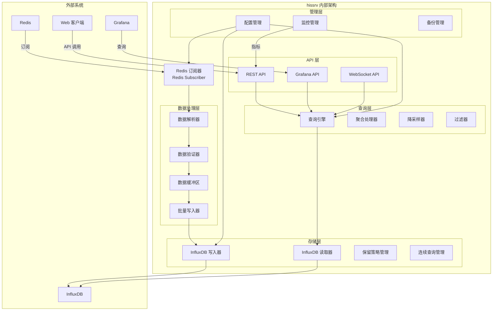

# 历史数据服务 (Historical Service - hissrv)

## 功能概述

hissrv 是 VoltageEMS 系统的历史数据存储服务，负责将实时数据从 Redis 持久化到 InfluxDB 时序数据库，并提供历史数据查询、分析和可视化接口。该服务是系统数据持久化和历史分析的核心组件。

## 主要功能

### 1. 数据持久化
- **实时数据订阅**: 从 Redis 订阅实时数据变化
- **批量写入**: 高效批量写入 InfluxDB，优化性能
- **数据缓冲**: 内存缓冲区防止数据丢失
- **重试机制**: 失败数据自动重试

### 2. 数据查询
- **时间范围查询**: 支持任意时间段数据查询
- **聚合查询**: 提供多种聚合函数（平均、最大、最小等）
- **降采样**: 自动降采样优化大时间范围查询
- **多维度查询**: 支持标签过滤和分组

### 3. Grafana 集成
- **原生数据源**: 作为 Grafana 数据源提供数据
- **仪表板模板**: 预置能源管理仪表板
- **实时刷新**: 支持仪表板实时数据更新
- **告警集成**: 与 Grafana 告警系统集成

### 4. 数据管理
- **数据保留策略**: 自动清理过期数据
- **数据压缩**: 历史数据自动压缩存储
- **备份恢复**: 支持数据备份和恢复
- **数据导出**: 支持 CSV、JSON 等格式导出

## 架构设计



## 配置说明

### 主配置文件 (hissrv.yaml)
```yaml
server:
  host: "0.0.0.0"
  port: 8090
  
redis:
  url: "redis://127.0.0.1:6379"
  subscribe_patterns:
    - "telemetry:*"
    - "signal:*"
    - "control:*"
    - "adjustment:*"
  
influxdb:
  url: "http://localhost:8086"
  org: "voltageems"
  bucket: "voltage_data"
  token: "your-token-here"
  
storage:
  batch_size: 1000
  flush_interval: 5s
  buffer_size: 10000
  retry_attempts: 3
  
retention:
  raw_data: "7d"
  hourly_data: "30d"
  daily_data: "365d"
  monthly_data: "5y"
```

### Grafana 数据源配置
```yaml
apiVersion: 1
datasources:
  - name: HisServ
    type: influxdb
    access: proxy
    url: http://influxdb:8086
    jsonData:
      version: Flux
      organization: voltageems
      defaultBucket: voltage_data
      tlsSkipVerify: true
    secureJsonData:
      token: $INFLUXDB_TOKEN
```

## API 接口

### 数据查询 API
- `GET /api/v1/query`: 查询历史数据
- `GET /api/v1/query/range`: 时间范围查询
- `GET /api/v1/aggregations`: 聚合查询
- `GET /api/v1/series`: 获取数据序列列表

### 数据管理 API
- `GET /api/v1/retention`: 获取保留策略
- `PUT /api/v1/retention`: 更新保留策略
- `POST /api/v1/backup`: 创建数据备份
- `POST /api/v1/restore`: 恢复数据

### Grafana 兼容 API
- `GET /api/grafana/query`: Grafana 查询接口
- `GET /api/grafana/search`: 搜索可用指标
- `GET /api/grafana/annotations`: 获取注释数据

### WebSocket API
- `/ws/subscribe`: 订阅实时数据推送
- `/ws/history`: 历史数据流式传输

## 数据模型

### 时序数据结构
```
measurement: device_data
tags:
  - device_id: 设备标识
  - channel: 通道名称
  - point_type: 数据类型（telemetry/signal/control/adjustment）
fields:
  - value: 数据值
  - quality: 数据质量
  - status: 设备状态
timestamp: 纳秒级时间戳
```

### 查询示例
```flux
from(bucket: "voltage_data")
  |> range(start: -1h)
  |> filter(fn: (r) => r["_measurement"] == "device_data")
  |> filter(fn: (r) => r["device_id"] == "device_001")
  |> aggregateWindow(every: 1m, fn: mean)
```

## 部署说明

### Docker 部署
```bash
docker build -t hissrv .
docker run -d --name hissrv \
  -v ./config:/app/config \
  -p 8090:8090 \
  --network voltageems_net \
  hissrv
```

### 本地开发
```bash
cd services/Hissrv
cargo build --release
RUST_LOG=info cargo run
```

## 性能优化

1. **批量写入**: 默认 1000 条记录批量写入
2. **内存缓冲**: 10000 条记录缓冲区
3. **并发处理**: 多线程并发写入
4. **查询缓存**: 热点数据查询缓存
5. **索引优化**: 自动创建时间和标签索引

## 监控指标

- `hissrv_messages_received_total`: 接收消息总数
- `hissrv_writes_total`: InfluxDB 写入总数
- `hissrv_write_errors_total`: 写入错误总数
- `hissrv_query_duration_seconds`: 查询耗时
- `hissrv_buffer_usage`: 缓冲区使用率

## 故障排查

1. **数据丢失**: 检查 Redis 连接和订阅模式
2. **写入延迟**: 调整批量大小和刷新间隔
3. **查询超时**: 优化查询范围，使用降采样
4. **存储空间**: 检查保留策略，清理过期数据

## 相关服务

- **comsrv**: 数据源，写入实时数据到 Redis
- **modsrv**: 计算结果也会被持久化
- **alarmsrv**: 告警历史存储
- **前端**: 通过 API 查询展示历史数据