# Alarm Service (alarmsrv)

Advanced alarm management service for the Voltage EMS system with intelligent classification, Redis storage, and cloud integration.

## 🎯 Core Features

- ✅ **Advanced Alarm Management**: Complete alarm lifecycle with creation, acknowledgment, resolution, and escalation
- ✅ **Intelligent Classification**: Rule-based automatic categorization (Environmental, Power, Communication, System, Security)
- ✅ **Redis Storage & Indexing**: Persistent storage with multi-dimensional indexing for fast queries
- ✅ **Real-time Monitoring**: Redis data stream listening with automatic alarm triggering
- ✅ **Edge System Design**: Optimized for edge computing with Redis-based data management
- ✅ **Cloud Integration**: Seamless integration with netsrv for cloud platform push (AWS IoT, Alibaba Cloud, Azure)
- ✅ **Statistics & Analytics**: Comprehensive alarm statistics and trend analysis
- ✅ **Auto Escalation**: Time-based alarm escalation with configurable rules
- ✅ **RESTful API**: Full-featured REST API for external integrations
- ✅ **Auto Cleanup**: Automatic cleanup of old resolved alarms

## 📊 System Architecture

Alarmsrv serves as the intelligent alarm management hub in the Voltage EMS ecosystem, designed for edge computing with distributed responsibility architecture:

```mermaid
graph TD
    subgraph "Data Sources"
        Devices["Industrial Devices<br/>Modbus/CAN/IEC104"]
        External["External Systems<br/>API/MQTT/HTTP"]
    end
    
    subgraph "Data Collection"
        Comsrv["Communication Service<br/>(Comsrv)"]
    end
    
    subgraph "Message Broker"
        Redis[("Redis<br/>Message Queue & Storage")]
    end
    
    subgraph "Processing Layer"
        Modsrv["Model Service<br/>(Modsrv)"]
        Hissrv["History Service<br/>(Hissrv)"]
        Netsrv["Network Service<br/>(Netsrv)"]
        Alarmsrv["🚨 Alarm Service<br/>(Alarmsrv)"]
    end
    
    subgraph "Alarmsrv Internal Architecture"
        Listener["Redis Listener<br/>Data Monitoring"]
        Classifier["Smart Classifier<br/>Rule Engine"]
        Storage["Redis Storage<br/>Multi-Index"]
        Processor["Alarm Processor<br/>Escalation & Cleanup"]
        API["REST API<br/>External Interface"]
    end
    
    subgraph "Storage Systems"
        RedisIndex["Redis Indexes<br/>Category/Level/Status/Date"]
        InfluxDB[("InfluxDB<br/>Time Series")]
    end
    
    subgraph "User Interfaces"
        WebUI["Web Interface<br/>Vue.js"]
        ElectronApp["Desktop App<br/>Electron"]
        MobileApp["Mobile App"]
    end
    
    subgraph "Cloud Platforms"
        AWS["AWS IoT Core"]
        Aliyun["Alibaba Cloud IoT"]
        Azure["Azure IoT Hub"]
        MQTT["MQTT Brokers"]
    end
    
    subgraph "Notification Channels"
        Email["Email Alerts"]
        SMS["SMS Notifications"]
        Webhook["Webhook Integration"]
        Push["Push Notifications"]
    end
    
    %% Data Flow
    Devices --> Comsrv
    External --> Comsrv
    Comsrv --> Redis
    Redis --> Modsrv
    Redis --> Hissrv
    Redis --> Netsrv
    Redis --> Alarmsrv
    
    %% Alarmsrv Internal Flow
    Alarmsrv --> Listener
    Listener --> Classifier
    Classifier --> Storage
    Storage --> RedisIndex
    Processor --> Storage
    API --> Storage
    
    %% Output Channels (Edge System Design)
    Alarmsrv --> Netsrv
    Netsrv --> AWS
    Netsrv --> Aliyun
    Netsrv --> Azure
    Netsrv --> MQTT
    Netsrv --> Email
    Netsrv --> SMS
    Netsrv --> Webhook
    Netsrv --> Push
    
    %% User Interfaces
    API --> WebUI
    API --> ElectronApp
    API --> MobileApp
    
    %% History Storage
    Hissrv --> InfluxDB
    
    style Alarmsrv fill:#ff6b6b,stroke:#333,stroke-width:3px
    style Classifier fill:#4ecdc4,stroke:#333,stroke-width:2px
    style Storage fill:#45b7d1,stroke:#333,stroke-width:2px
```



## 🔄 Alarm Processing Flow


## 🚀 Quick Start

### 1. Prerequisites
```bash
# Start Redis server
docker run -d --name redis -p 6379:6379 redis:latest

# Or use existing Redis instance
redis-server --daemonize yes
```

### 2. Configuration
Create `alarmsrv.yaml`:

#### TCP Connection (Default)
```yaml
redis:
  connection_type: "Tcp"
  host: "localhost"
  port: 6379
  # password: "your_password"  # optional
  database: 0

api:
  host: "0.0.0.0"
  port: 8080

storage:
  retention_days: 30
  auto_cleanup: true
  cleanup_interval_hours: 24
```

#### Unix Socket Connection
```yaml
redis:
  connection_type: "Unix"
  socket_path: "/var/run/redis/redis.sock"
  database: 0
  # password: "your_password"  # optional

api:
  host: "0.0.0.0"
  port: 8080

storage:
  retention_days: 30
  auto_cleanup: true
  cleanup_interval_hours: 24
```

### 3. Environment Variables (Optional)
```bash
# TCP Connection
export REDIS_CONNECTION_TYPE=tcp
export REDIS_HOST=localhost
export REDIS_PORT=6379
# export REDIS_PASSWORD=your_password

# Unix Socket Connection
export REDIS_CONNECTION_TYPE=unix
export REDIS_SOCKET_PATH=/var/run/redis/redis.sock
# export REDIS_PASSWORD=your_password

# Common variables
export REDIS_DB=0
export API_HOST=0.0.0.0
export API_PORT=8080
```

### 4. Run the Service
```bash
cd services/alarmsrv
cargo run
```

Service will start on `http://localhost:8080`

## 📡 REST API Reference

### Health & Status
```bash
# Health check
GET /health

# Service status with statistics
GET /status
# Response: service info, active alarms, Redis connection status
```

### Alarm Management
```bash
# List alarms with optional filtering
GET /alarms?category=Environmental&level=Critical&status=Active&limit=50

# Create new alarm
POST /alarms
Content-Type: application/json
{
  "title": "High Temperature Alert",
  "description": "Critical temperature detected: 95.2°C",
  "level": "Critical"
}

# Acknowledge alarm
POST /alarms/{id}/ack

# Resolve alarm
POST /alarms/{id}/resolve
```

### Classification & Analytics
```bash
# Get alarm statistics
GET /stats
# Response: counts by category, level, status, trends

# Classify existing alarms
POST /alarms/classify
# Response: classification results

# Get available categories
GET /alarms/categories
# Response: Environmental, Power, Communication, System, Security
```

## 🏷️ Alarm Classification System

### Categories
- **Environmental**: Temperature, humidity, air quality alarms
- **Power**: Voltage, current, power supply related alarms
- **Communication**: Network, protocol, connectivity issues
- **System**: Hardware, software, performance alarms
- **Security**: Access, authentication, security breaches

### Severity Levels
- **Critical**: Immediate action required, system failure imminent
- **Major**: Significant impact, requires urgent attention
- **Minor**: Limited impact, scheduled maintenance needed
- **Warning**: Potential issue, monitoring required
- **Info**: Informational, no action needed

### Classification Rules
```rust
// Example classification patterns
Environmental: ["temperature", "temp", "humidity", "°C", "°F"]
Power: ["voltage", "current", "power", "supply", "battery"]
Communication: ["connection", "network", "timeout", "protocol"]
System: ["cpu", "memory", "disk", "performance", "service"]
Security: ["access", "auth", "login", "security", "breach"]
```

## 🔄 Auto-Triggered Alarms

The service monitors Redis data streams and automatically generates alarms based on configured thresholds:

### Temperature Monitoring
```bash
# Test auto alarm generation
redis-cli PUBLISH ems:data:temperature '{"value": 85.5, "unit": "°C", "location": "Server Room"}'
```

### Custom Data Patterns
```json
{
  "value": 95.2,
  "unit": "°C", 
  "location": "Generator Room",
  "equipment_id": "GEN_001",
  "timestamp": "2024-01-15T10:30:00Z"
}
```

## 📈 Monitoring & Metrics

### Redis Storage Structure
```
alarms:all              # Sorted set of all alarms
alarms:category:{cat}   # Alarms by category
alarms:level:{level}    # Alarms by severity level
alarms:status:{status}  # Alarms by status
alarms:date:{date}      # Alarms by date
alarms:stats            # Statistics hash
alarm:{id}              # Individual alarm data
```

### Edge System Integration

The alarm data is published to Redis channels for netsrv to handle external communications:

```json
{
  "alarm_id": "uuid-string",
  "title": "High Temperature Alert",
  "category": "Environmental",
  "level": "Critical",
  "status": "Active",
  "timestamp": "2024-01-15T10:30:00Z",
  "source": "alarmsrv",
  "metadata": {
    "equipment_id": "HVAC_001",
    "location": "Server Room",
    "value": 85.5,
    "unit": "°C"
  }
}
```

**Redis Channels:**
- `ems:data:alarms` - Real-time alarm events for netsrv
- `ems:cloud:alarms:queue` - Batch processing queue

## ⚙️ Configuration Details

### Complete Configuration File
```yaml
redis:
  host: localhost
  port: 6379
  password: null
  database: 0
  timeout_ms: 5000
  max_connections: 10

api:
  host: 0.0.0.0
  port: 8080
  cors_enabled: true
  max_request_size: 1048576

storage:
  retention_days: 30
  max_alarms_per_category: 10000
  cleanup_interval_seconds: 3600

classification:
  confidence_threshold: 0.8
  auto_escalation_enabled: true
  escalation_rules:
    - from_level: "Warning"
      to_level: "Minor"
      after_seconds: 3600
    - from_level: "Minor"
      to_level: "Major"
      after_seconds: 1800

edge_system:
  redis_publish_enabled: true
  netsrv_integration: true
  cloud_queue_enabled: true
```

## 🧪 Testing

### Manual Testing
```bash
# Start the service
cargo run

# Create test alarm
curl -X POST http://localhost:8080/alarms \
  -H "Content-Type: application/json" \
  -d '{"title":"Test Alarm","description":"Test description","level":"Warning"}'

# Check statistics
curl http://localhost:8080/stats

# List alarms
curl http://localhost:8080/alarms
```

### Integration Testing
```bash
# Run all tests
cargo test

# Run specific test module
cargo test classification_tests
cargo test storage_tests
```

## 🔧 Development

### Project Structure
```
src/
├── main.rs           # Main service entry point
├── types.rs          # Data structures and enums
├── config.rs         # Configuration management
├── storage.rs        # Redis storage implementation
├── classifier.rs     # Intelligent classification engine
└── lib.rs           # Library exports
```

### Adding New Classification Rules
```rust
// In classifier.rs
fn create_custom_rules() -> Vec<ClassificationRule> {
    vec![
        ClassificationRule {
            category: AlarmCategory::Custom,
            patterns: vec!["custom_pattern".to_string()],
            weight: 1.0,
            min_confidence: 0.7,
        }
    ]
}
```

## 📊 Performance Metrics

- **Response Time**: < 10ms for alarm creation
- **Throughput**: > 1000 alarms/second processing capacity
- **Storage**: Efficient Redis indexing with O(log N) queries
- **Memory Usage**: < 100MB baseline, scales with alarm volume
- **Cleanup**: Automatic cleanup maintains optimal performance

## 🚀 Deployment

### Docker Deployment
```dockerfile
FROM rust:1.75 as builder
WORKDIR /app
COPY . .
RUN cargo build --release

FROM debian:bookworm-slim
RUN apt-get update && apt-get install -y ca-certificates
COPY --from=builder /app/target/release/alarmsrv /usr/local/bin/
CMD ["alarmsrv"]
```

### Docker Compose
```yaml
version: '3.8'
services:
  alarmsrv:
    build: .
    ports:
      - "8080:8080"
    environment:
      - REDIS_HOST=redis
      - REDIS_PORT=6379
    depends_on:
      - redis
  
  redis:
    image: redis:7-alpine
    ports:
      - "6379:6379"
```

## 🔍 Troubleshooting

### Common Issues
1. **Redis Connection Failed**: Check Redis server status and network connectivity
2. **High Memory Usage**: Adjust retention settings and enable cleanup
3. **Classification Accuracy**: Tune confidence thresholds and add custom rules
4. **API Rate Limiting**: Implement rate limiting for high-volume scenarios

### Logs Analysis
```bash
# Enable debug logging
RUST_LOG=debug cargo run

# Monitor Redis operations
redis-cli monitor

# Check alarm statistics
curl http://localhost:8080/stats | jq
```

## 📞 Support

For questions, issues, or contributions:
- Create issues in the project repository
- Check the main Voltage EMS documentation
- Review the API documentation and examples
- Monitor system logs for detailed error information

## 🏗️ Edge System Design

### Distributed Responsibility Architecture

**Service Responsibilities:**
- **alarmsrv**: Alarm detection, classification, and storage management
- **Redis**: Data hub, message queue, and event distribution
- **netsrv**: External network communications and cloud integrations

**Design Benefits:**
- 📦 **Resource Optimization**: Reduced network dependencies on edge devices
- 🔄 **Loose Coupling**: Independent service development and deployment
- 🚀 **High Performance**: Redis provides millisecond-level data access
- 🛡️ **Fault Tolerance**: Service failure isolation, high system stability

**Data Flow:**
```
Alarm Event → Redis Storage → Redis PUBLISH → netsrv → External Systems
           ↓
     Multi-dimensional Indexing
```

This architecture ensures that alarmsrv remains lightweight and focused on its core mission while leveraging the system's distributed capabilities for comprehensive alarm management and external integrations.