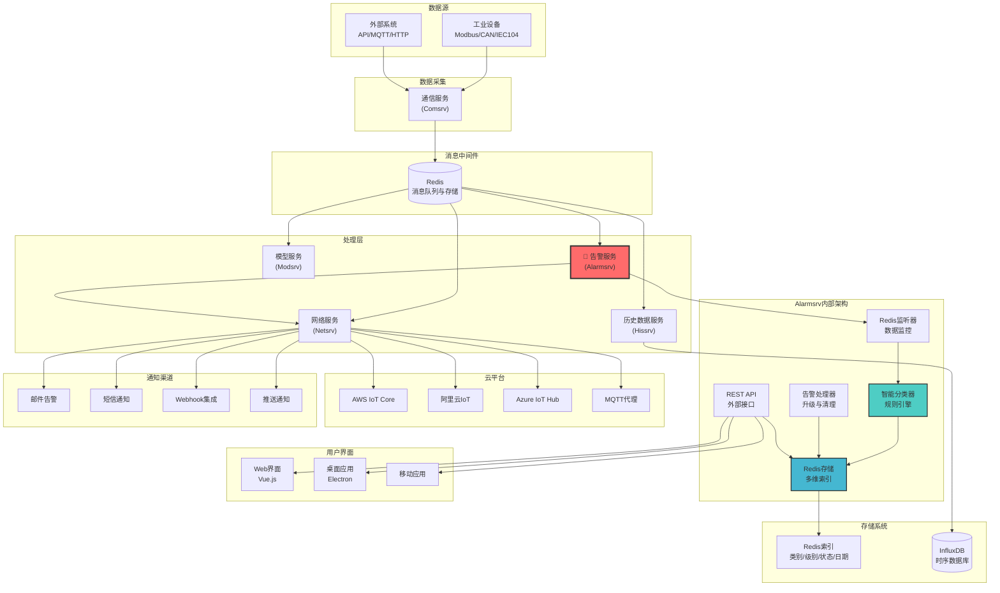
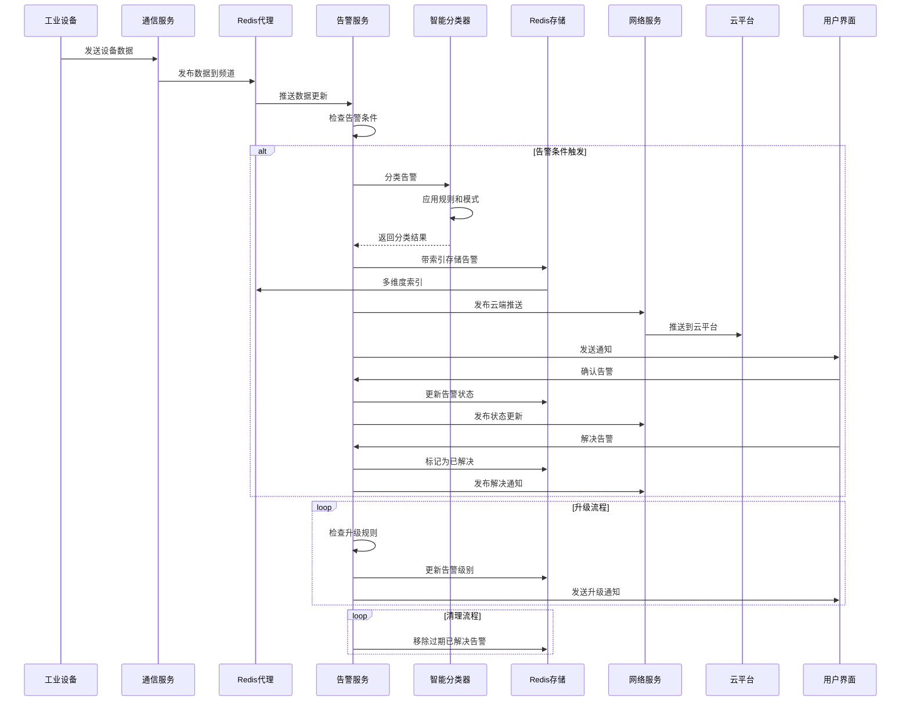

# 告警服务 (alarmsrv)

适用于Voltage EMS系统的高级告警管理服务，具备智能分类、Redis存储和云端集成功能。

## 🎯 核心特性

- ✅ **高级告警管理**：完整的告警生命周期管理，包括创建、确认、解决和升级
- ✅ **智能分类系统**：基于规则引擎的自动分类（环境、电力、通信、系统、安全）
- ✅ **Redis存储与索引**：多维度索引的持久化存储，支持快速查询
- ✅ **实时监控**：Redis数据流监听，自动触发告警
- ✅ **边端系统设计**：针对边缘计算优化，基于Redis的数据管理架构
- ✅ **云端集成**：与netsrv无缝集成，支持云平台推送（AWS IoT、阿里云、Azure）
- ✅ **统计与分析**：全面的告警统计和趋势分析
- ✅ **自动升级**：基于时间的告警升级与可配置规则
- ✅ **RESTful API**：功能完整的REST API，支持外部集成
- ✅ **自动清理**：自动清理已解决的过期告警

## 📊 系统架构

Alarmsrv作为Voltage EMS生态系统中的智能告警管理中心，采用边缘计算分布式职责架构设计：



## 🔄 告警处理流程



## 🚀 快速开始

### 1. 前置条件

```bash
# 启动Redis服务器
docker run -d --name redis -p 6379:6379 redis:latest

# 或使用现有Redis实例
redis-server --daemonize yes
```

### 2. 配置

创建 `alarmsrv.yaml`：

```yaml
redis:
  host: localhost
  port: 6379
  password: null
  database: 0

api:
  host: 0.0.0.0
  port: 8080

storage:
  retention_days: 30

classification:
  confidence_threshold: 0.8
  auto_escalation_enabled: true
```

### 3. 环境变量（可选）

```bash
export REDIS_HOST=localhost
export REDIS_PORT=6379
export API_HOST=0.0.0.0
export API_PORT=8080
```

### 4. 启动服务

```bash
cd services/alarmsrv
cargo run
```

服务将在 `http://localhost:8080` 启动

## 📡 REST API 参考

### 健康状态与监控

```bash
# 健康检查
GET /health

# 服务状态及统计信息
GET /status
# 响应：服务信息、活跃告警数、Redis连接状态
```

### 告警管理

```bash
# 列出告警（支持可选过滤）
GET /alarms?category=Environmental&level=Critical&status=Active&limit=50

# 创建新告警
POST /alarms
Content-Type: application/json
{
  "title": "高温告警",
  "description": "检测到危险高温：95.2°C",
  "level": "Critical"
}

# 确认告警
POST /alarms/{id}/ack

# 解决告警
POST /alarms/{id}/resolve
```

### 分类与分析

```bash
# 获取告警统计
GET /stats
# 响应：按类别、级别、状态的统计数据和趋势

# 分类现有告警
POST /alarms/classify
# 响应：分类结果

# 获取可用类别
GET /alarms/categories
# 响应：Environmental, Power, Communication, System, Security
```

## 🏷️ 告警分类系统

### 分类体系

- **Environmental（环境类）**：温度、湿度、空气质量告警
- **Power（电力类）**：电压、电流、电源相关告警
- **Communication（通信类）**：网络、协议、连接问题
- **System（系统类）**：硬件、软件、性能告警
- **Security（安全类）**：访问控制、认证、安全漏洞

### 严重级别

- **Critical（危急）**：需要立即行动，系统故障临近
- **Major（重要）**：显著影响，需要紧急关注
- **Minor（一般）**：影响有限，需要计划性维护
- **Warning（警告）**：潜在问题，需要监控
- **Info（信息）**：信息性通知，无需行动

### 分类规则

```rust
// 分类模式示例
Environmental: ["temperature", "temp", "humidity", "°C", "°F"]
Power: ["voltage", "current", "power", "supply", "battery"]
Communication: ["connection", "network", "timeout", "protocol"]
System: ["cpu", "memory", "disk", "performance", "service"]
Security: ["access", "auth", "login", "security", "breach"]
```

## 🔄 自动触发告警

服务监控Redis数据流，基于配置的阈值自动生成告警：

### 温度监控

```bash
# 测试自动告警生成
redis-cli PUBLISH ems:data:temperature '{"value": 85.5, "unit": "°C", "location": "服务器机房"}'
```

### 自定义数据模式

```json
{
  "value": 95.2,
  "unit": "°C", 
  "location": "发电机房",
  "equipment_id": "GEN_001",
  "timestamp": "2024-01-15T10:30:00Z"
}
```

## 📈 监控与指标

### Redis存储结构

```
alarms:all              # 所有告警的有序集合
alarms:category:{cat}   # 按类别分组的告警
alarms:level:{level}    # 按严重级别分组的告警
alarms:status:{status}  # 按状态分组的告警
alarms:date:{date}      # 按日期分组的告警
alarms:stats            # 统计信息哈希表
alarm:{id}              # 单个告警数据
```

### 边端系统集成

告警数据通过Redis频道发布，由netsrv处理外部通信：

```json
{
  "alarm_id": "uuid-string",
  "title": "高温告警",
  "category": "Environmental",
  "level": "Critical",
  "status": "Active",
  "timestamp": "2024-01-15T10:30:00Z",
  "source": "alarmsrv",
  "metadata": {
    "equipment_id": "HVAC_001",
    "location": "服务器机房",
    "value": 85.5,
    "unit": "°C"
  }
}
```

**Redis频道：**

- `ems:data:alarms` - 实时告警事件，供netsrv监听
- `ems:cloud:alarms:queue` - 批处理队列

## ⚙️ 配置详情

### 完整配置文件

```yaml
redis:
  host: localhost
  port: 6379
  password: null
  database: 0
  timeout_ms: 5000
  max_connections: 10

api:
  host: 0.0.0.0
  port: 8080
  cors_enabled: true
  max_request_size: 1048576

storage:
  retention_days: 30
  max_alarms_per_category: 10000
  cleanup_interval_seconds: 3600

classification:
  confidence_threshold: 0.8
  auto_escalation_enabled: true
  escalation_rules:
    - from_level: "Warning"
      to_level: "Minor"
      after_seconds: 3600
    - from_level: "Minor"
      to_level: "Major"
      after_seconds: 1800

edge_system:
  redis_publish_enabled: true
  netsrv_integration: true
  cloud_queue_enabled: true
```

## 🧪 测试

### 手动测试

```bash
# 启动服务
cargo run

# 创建测试告警
curl -X POST http://localhost:8080/alarms \
  -H "Content-Type: application/json" \
  -d '{"title":"测试告警","description":"测试描述","level":"Warning"}'

# 检查统计信息
curl http://localhost:8080/stats

# 列出告警
curl http://localhost:8080/alarms
```

### 集成测试

```bash
# 运行所有测试
cargo test

# 运行特定测试模块
cargo test classification_tests
cargo test storage_tests
```

## 🔧 开发指南

### 项目结构

```
src/
├── main.rs           # 主服务入口
├── types.rs          # 数据结构和枚举
├── config.rs         # 配置管理
├── storage.rs        # Redis存储实现
├── classifier.rs     # 智能分类引擎
└── lib.rs           # 库导出
```

### 添加新分类规则

```rust
// 在 classifier.rs 中
fn create_custom_rules() -> Vec<ClassificationRule> {
    vec![
        ClassificationRule {
            category: AlarmCategory::Custom,
            patterns: vec!["自定义模式".to_string()],
            weight: 1.0,
            min_confidence: 0.7,
        }
    ]
}
```

## 📊 性能指标

- **响应时间**：告警创建 < 10毫秒
- **吞吐量**：> 1000 告警/秒处理能力
- **存储效率**：Redis索引，O(log N)查询复杂度
- **内存使用**：< 100MB基线，随告警量线性扩展
- **自动清理**：定期清理保持最佳性能

## 🚀 部署

### Docker部署

```dockerfile
FROM rust:1.75 as builder
WORKDIR /app
COPY . .
RUN cargo build --release

FROM debian:bookworm-slim
RUN apt-get update && apt-get install -y ca-certificates
COPY --from=builder /app/target/release/alarmsrv /usr/local/bin/
CMD ["alarmsrv"]
```

### Docker Compose

```yaml
version: '3.8'
services:
  alarmsrv:
    build: .
    ports:
      - "8080:8080"
    environment:
      - REDIS_HOST=redis
      - REDIS_PORT=6379
    depends_on:
      - redis
  
  redis:
    image: redis:7-alpine
    ports:
      - "6379:6379"
```

## 🔍 故障排除

### 常见问题

1. **Redis连接失败**：检查Redis服务状态和网络连接
2. **内存使用过高**：调整保留期设置并启用清理
3. **分类准确性不足**：调整置信度阈值并添加自定义规则
4. **API速率限制**：为高容量场景实施速率限制

### 日志分析

```bash
# 启用调试日志
RUST_LOG=debug cargo run

# 监控Redis操作
redis-cli monitor

# 检查告警统计
curl http://localhost:8080/stats | jq
```

## 📞 技术支持

如有问题、意见或贡献：

- 在项目仓库中创建Issue
- 查看主要的Voltage EMS文档
- 查阅API文档和示例
- 监控系统日志获取详细错误信息

## 🆚 版本说明

### 当前版本特性

- ✅ 智能告警分类（5大类别）
- ✅ Redis多维度存储索引
- ✅ netsrv云端集成
- ✅ 自动升级和清理机制
- ✅ 完整的REST API

### 边端系统设计说明

**职责分离架构：**

- **alarmsrv**: 专注告警检测、分类、存储管理
- **Redis**: 数据中心、消息队列、事件分发
- **netsrv**: 负责所有外部网络通信和云端集成

**设计优势：**

- 📦 资源优化：减少边端设备网络依赖
- 🔄 松耦合：各服务独立开发和部署
- 🚀 高性能：Redis提供毫秒级数据访问
- 🛡️ 容错性：服务故障隔离，系统稳定性高

### 未来规划

- 🔄 机器学习增强分类
- 🔄 Redis数据结构优化
- 🔄 高级报表和仪表板
- 🔄 分布式部署支持
- 🔄 移动应用原生支持
