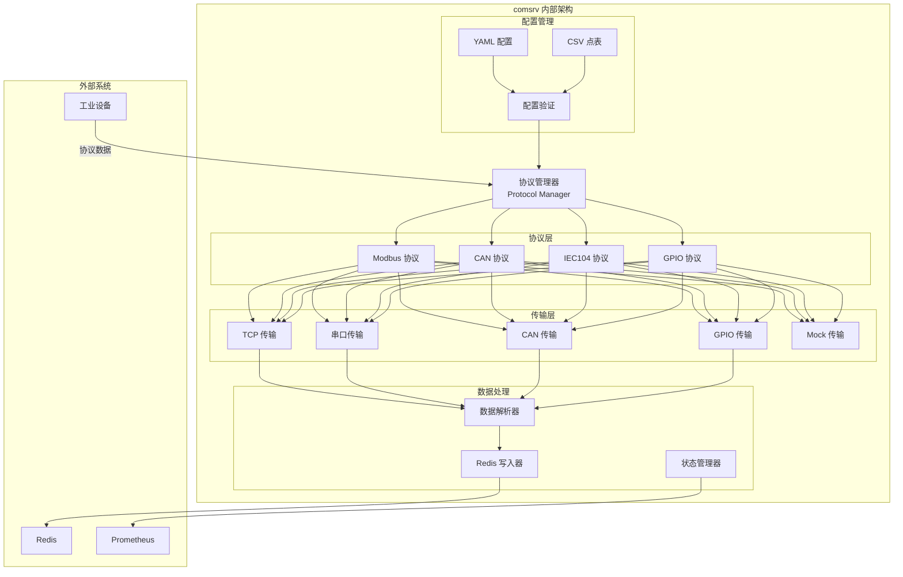

# 通信服务 (Communication Service - comsrv)

## 功能概述

comsrv 是 VoltageEMS 系统的工业通信服务核心组件，负责与各种工业设备进行数据采集和控制指令下发。该服务实现了多种工业通信协议，并通过统一的传输层架构提供灵活的部署方式。

## 主要功能

### 1. 多协议支持
- **Modbus TCP/RTU**: 支持主站模式，可连接各类 Modbus 设备
- **CAN 总线**: 支持标准帧和扩展帧，适用于车载和工业控制
- **IEC 60870-5-104**: 电力行业标准协议，支持遥测、遥信、遥控
- **GPIO**: 直接控制数字输入输出，用于简单的开关量采集和控制

### 2. 统一传输层架构
- 协议逻辑与物理传输分离
- 支持 TCP、串口、CAN、GPIO 等多种传输方式
- Mock 传输层支持协议测试
- 工业级错误处理和统计

### 3. 数据管理
- 实时数据写入 Redis
- 支持遥测、遥信、遥控、遥调四种数据类型
- CSV 配置文件管理点表
- 灵活的通道和设备管理

### 4. 高可用性
- 自动重连机制
- 设备状态监控
- Prometheus 指标导出
- 结构化日志记录

## 架构设计



## 配置说明

### 主配置文件 (config.yaml)
```yaml
redis:
  url: "redis://127.0.0.1:6379"
  
server:
  port: 8081
  
channels:
  - name: "modbus_channel_1"
    protocol: "modbus"
    transport:
      type: "tcp"
      host: "192.168.1.100"
      port: 502
    device_configs:
      - device_id: 1
        slave_id: 1
        config_path: "./config/Modbus_Test_1"
```

### CSV 点表配置
每个设备需要配置四个 CSV 文件：
- `telemetry.csv`: 遥测点（模拟量）
- `signal.csv`: 遥信点（开关量）
- `control.csv`: 遥控点（控制命令）
- `adjustment.csv`: 遥调点（设定值）

### 映射配置
- `mapping_*.csv`: 地址映射表，支持自定义寄存器映射

## 部署说明

### Docker 部署
```bash
docker build -t comsrv .
docker run -d --name comsrv \
  -v ./config:/app/config \
  -p 8081:8081 \
  --network voltageems_net \
  comsrv
```

### 本地开发
```bash
cd services/comsrv
cargo build --release
RUST_LOG=info cargo run
```

## 监控指标

服务通过 `/metrics` 端点暴露以下 Prometheus 指标：
- `comsrv_devices_connected`: 已连接设备数
- `comsrv_messages_received_total`: 接收消息总数
- `comsrv_messages_sent_total`: 发送消息总数
- `comsrv_errors_total`: 错误总数
- `comsrv_response_time_seconds`: 响应时间直方图

## 扩展开发

### 添加新协议
1. 实现 `Protocol` trait
2. 实现对应的 `Transport` trait
3. 在 `ProtocolFactory` 中注册
4. 添加配置解析逻辑

### 添加新传输层
1. 实现 `Transport` trait
2. 在 `TransportFactory` 中注册
3. 更新配置结构

## 故障排查

1. **连接失败**: 检查网络配置和防火墙设置
2. **数据不更新**: 验证点表配置和 Redis 连接
3. **性能问题**: 调整轮询间隔和批量大小
4. **协议错误**: 启用 DEBUG 日志查看详细通信过程

## 相关服务

- **modsrv**: 消费 comsrv 采集的数据进行计算
- **hissrv**: 将 Redis 数据持久化到 InfluxDB
- **alarmsrv**: 基于采集数据生成告警
- **netsrv**: 转发数据到云平台