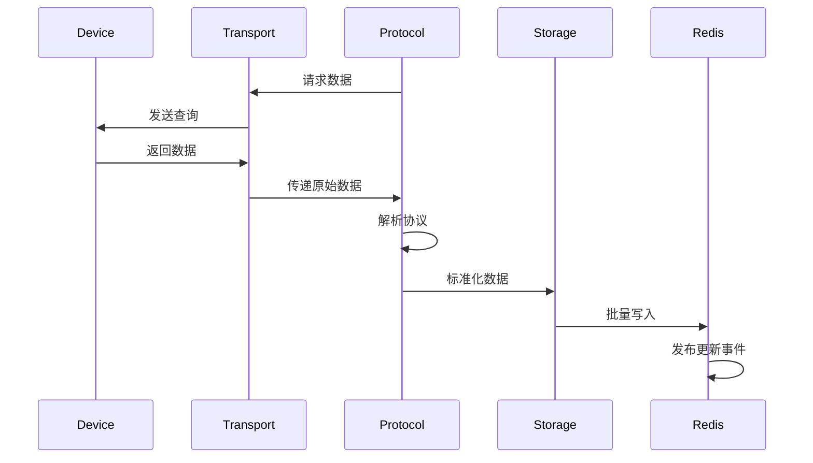
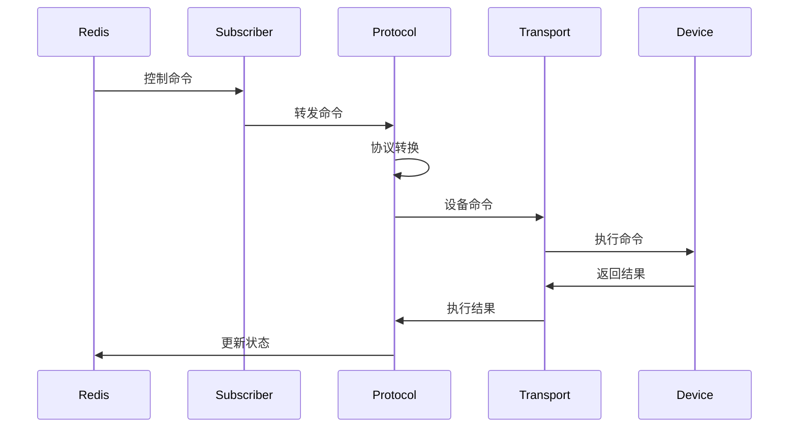

# comsrv 架构设计

## 概述

comsrv（Communication Service）是 VoltageEMS 的核心通信服务，负责与工业设备的实时数据交互。采用插件化架构设计，支持多种工业协议，通过统一的传输层抽象实现跨平台部署。

## 架构特点

1. **插件化协议支持**：易于扩展新协议
2. **统一传输层**：抽象 TCP、Serial、CAN 等传输方式
3. **高性能设计**：零拷贝、批量处理、异步 I/O
4. **命令订阅机制**：实时响应控制命令
5. **完善的错误处理**：自动重连、优雅降级

## 系统架构图

```
┌─────────────────────────────────────────────────────────────┐
│                        comsrv                                │
├─────────────────────────────────────────────────────────────┤
│                    Protocol Factory                          │
│  ┌──────────┐  ┌──────────┐  ┌──────────┐  ┌──────────┐   │
│  │  Modbus  │  │IEC60870  │  │   CAN    │  │  Custom  │   │
│  │  Plugin  │  │  Plugin  │  │  Plugin  │  │  Plugin  │   │
│  └────┬─────┘  └────┬─────┘  └────┬─────┘  └────┬─────┘   │
│       └──────────────┴──────────────┴──────────────┘        │
│                            │                                 │
│                    Transport Layer                           │
│  ┌──────────┐  ┌──────────┐  ┌──────────┐  ┌──────────┐   │
│  │   TCP    │  │  Serial  │  │   CAN    │  │   GPIO   │   │
│  │Transport │  │Transport │  │Transport │  │Transport │   │
│  └────┬─────┘  └────┬─────┘  └────┬─────┘  └────┬─────┘   │
├───────┴──────────────┴──────────────┴──────────────┴────────┤
│                     Redis Storage                            │
│  ┌─────────────┐  ┌──────────────┐  ┌─────────────────┐    │
│  │ Point Write │  │ Batch Write  │  │ Command Subscribe│    │
│  └─────────────┘  └──────────────┘  └─────────────────┘    │
└─────────────────────────────────────────────────────────────┘
```

## 核心组件

### 1. Protocol Factory（协议工厂）

负责协议插件的注册、创建和管理。

```rust
pub struct ProtocolFactory {
    registry: Arc<PluginRegistry>,
    channels: Arc<RwLock<HashMap<u16, ChannelEntry>>>,
}

struct ChannelEntry {
    protocol: Arc<dyn ProtocolPlugin>,
    transport: Arc<dyn Transport>,
    telemetry: Arc<dyn FourTelemetryOperations>,
    command_subscriber: Option<CommandSubscriber>,
}
```

### 2. Protocol Plugin（协议插件）

所有协议实现的统一接口。

```rust
#[async_trait]
pub trait ProtocolPlugin: Send + Sync {
    /// 插件元数据
    fn metadata(&self) -> PluginMetadata;
    
    /// 初始化插件
    async fn initialize(&mut self, params: serde_yaml::Value) -> Result<()>;
    
    /// 启动数据采集
    async fn start(&mut self) -> Result<()>;
    
    /// 停止数据采集
    async fn stop(&mut self) -> Result<()>;
    
    /// 设置传输层
    fn set_transport(&mut self, transport: Arc<dyn Transport>);
    
    /// 设置四遥操作接口
    fn set_telemetry_ops(&mut self, ops: Arc<dyn FourTelemetryOperations>);
}
```

### 3. Transport Layer（传输层）

统一的传输层抽象，支持多种底层通信方式。

```rust
#[async_trait]
pub trait Transport: Send + Sync {
    /// 连接到设备
    async fn connect(&mut self) -> Result<()>;
    
    /// 断开连接
    async fn disconnect(&mut self) -> Result<()>;
    
    /// 读取数据
    async fn read(&mut self, buffer: &mut [u8]) -> Result<usize>;
    
    /// 写入数据
    async fn write(&mut self, data: &[u8]) -> Result<()>;
    
    /// 检查连接状态
    fn is_connected(&self) -> bool;
}
```

### 4. Command Subscriber（命令订阅器）

处理来自 Redis 的控制命令。

```rust
pub struct CommandSubscriber {
    redis_client: Arc<RedisClient>,
    handler: Arc<dyn FourTelemetryOperations>,
    channel_id: u16,
}

impl CommandSubscriber {
    /// 启动订阅
    pub async fn start(&mut self) -> Result<()> {
        let channels = vec![
            format!("cmd:{}:control", self.channel_id),
            format!("cmd:{}:adjustment", self.channel_id),
        ];
        
        // 订阅命令通道
        self.subscribe_channels(channels).await?;
    }
}
```

## 数据流程

### 1. 数据采集流程



### 2. 命令执行流程



## 协议插件开发

### 插件模板

```rust
pub struct MyProtocolPlugin {
    transport: Option<Arc<dyn Transport>>,
    telemetry_ops: Option<Arc<dyn FourTelemetryOperations>>,
    config: MyProtocolConfig,
    is_running: Arc<AtomicBool>,
}

#[async_trait]
impl ProtocolPlugin for MyProtocolPlugin {
    fn metadata(&self) -> PluginMetadata {
        PluginMetadata {
            name: "my_protocol".to_string(),
            version: "1.0.0".to_string(),
            protocol_type: "my_protocol".to_string(),
            author: "VoltageEMS Team".to_string(),
            description: "My custom protocol plugin".to_string(),
        }
    }
    
    async fn initialize(&mut self, params: serde_yaml::Value) -> Result<()> {
        self.config = serde_yaml::from_value(params)?;
        Ok(())
    }
    
    async fn start(&mut self) -> Result<()> {
        self.is_running.store(true, Ordering::SeqCst);
        
        // 启动轮询任务
        let plugin = self.clone();
        tokio::spawn(async move {
            plugin.polling_loop().await;
        });
        
        Ok(())
    }
}
```

### 数据采集实现

```rust
async fn polling_loop(&self) -> Result<()> {
    let mut interval = tokio::time::interval(self.config.polling_interval);
    
    while self.is_running.load(Ordering::SeqCst) {
        interval.tick().await;
        
        // 批量读取数据
        let updates = self.read_all_points().await?;
        
        // 批量更新到存储
        if let Some(ops) = &self.telemetry_ops {
            ops.batch_update_measurements(updates).await?;
        }
    }
    
    Ok(())
}
```

## Redis 存储接口

### 扁平化存储实现

```rust
/// 批量更新测量值
pub async fn batch_update_measurements(&self, updates: Vec<MeasurementUpdate>) -> Result<()> {
    let timestamp = chrono::Utc::now().timestamp_millis();
    let mut pipe = Pipeline::new();
    
    for update in updates {
        let key = format!("{}:m:{}", self.channel_id, update.point_id);
        let value = format!("{}:{}", update.value, timestamp);
        pipe.set(&key, &value);
    }
    
    pipe.query_async(&mut self.storage.conn).await?;
    
    // 发布批量更新事件
    self.publish_updates(&updates).await?;
    
    Ok(())
}
```

### 命令处理

```rust
/// 处理控制命令
async fn handle_control_command(&self, cmd: ControlCommand) -> Result<()> {
    // 查找对应的控制点
    let control = self.controls.iter()
        .find(|c| c.id == cmd.point_id)
        .ok_or_else(|| Error::PointNotFound)?;
    
    // 执行协议特定的命令
    self.execute_control(control, cmd.value).await?;
    
    // 更新状态
    let key = format!("{}:c:{}", self.channel_id, cmd.point_id);
    let value = format!("{}:{}", cmd.value, cmd.timestamp);
    self.storage.set_point(&key, &value).await?;
    
    Ok(())
}
```

## 性能优化

### 1. 批量处理
- 聚合多个读取请求
- 使用 Pipeline 批量写入
- 减少网络往返次数

### 2. 异步并发
- 多通道并行采集
- 非阻塞 I/O 操作
- 协程池管理

### 3. 内存优化
- 复用缓冲区
- 零拷贝传输
- 对象池技术

### 4. 连接管理
- 连接池复用
- 自动重连机制
- 健康检查

## 错误处理

### 1. 传输层错误
```rust
match transport.read(&mut buffer).await {
    Ok(n) => process_data(&buffer[..n]),
    Err(e) if e.is_timeout() => {
        warn!("Read timeout, retrying...");
        continue;
    }
    Err(e) if e.is_disconnected() => {
        error!("Connection lost, reconnecting...");
        self.reconnect().await?;
    }
    Err(e) => return Err(e.into()),
}
```

### 2. 协议错误
- CRC 校验失败：记录并跳过
- 格式错误：降级处理
- 超时：自动重试

### 3. 存储错误
- Redis 连接失败：本地缓存
- 写入失败：重试队列
- 容量限制：旧数据淘汰

## 监控指标

### 1. 性能指标
- 采集延迟：P50、P95、P99
- 吞吐量：points/s
- 批处理大小分布

### 2. 错误指标
- 错误率：按类型统计
- 重试次数
- 连接断开次数

### 3. 业务指标
- 活跃通道数
- 点位更新频率
- 命令执行成功率

## 配置管理

### 通道配置
```yaml
channels:
  - id: 1001
    name: "主变电站"
    protocol_type: "modbus_tcp"
    transport:
      type: "tcp"
      host: "192.168.1.100"
      port: 502
    protocol_params:
      slave_id: 1
      timeout_ms: 1000
      retry_count: 3
    points_config:
      base_path: "config/ModbusTCP_Test_01"
```

### 点表配置（CSV）
```csv
id,name,address,scale,offset,unit,description
10001,有功功率,1:3:100,0.1,0,kW,总有功功率
10002,无功功率,1:3:102,0.1,0,kVar,总无功功率
10003,功率因数,1:3:104,0.001,0,,功率因数
```

## 扩展指南

### 1. 添加新协议
1. 实现 `ProtocolPlugin` trait
2. 注册到 `PluginRegistry`
3. 配置协议参数
4. 编写单元测试

### 2. 添加新传输层
1. 实现 `Transport` trait
2. 注册到 `TransportFactory`
3. 处理平台特定代码
4. 测试连接稳定性

### 3. 自定义数据处理
1. 扩展 `FourTelemetryOperations`
2. 实现自定义转换逻辑
3. 添加数据验证
4. 性能测试