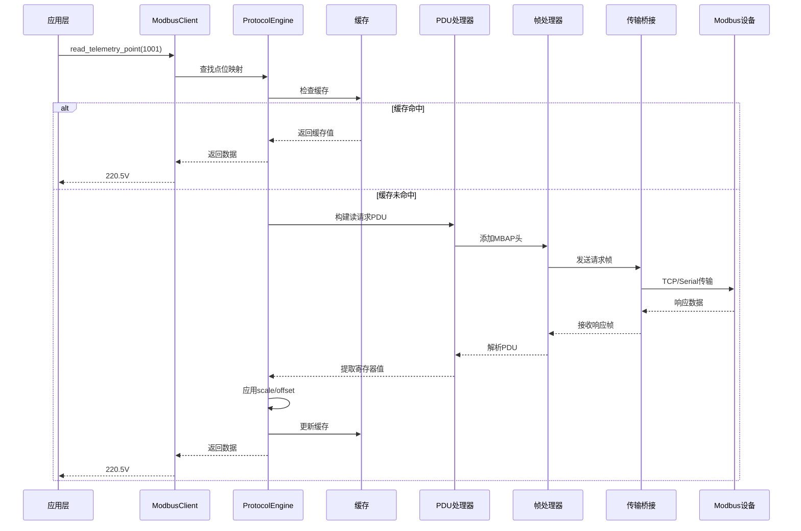
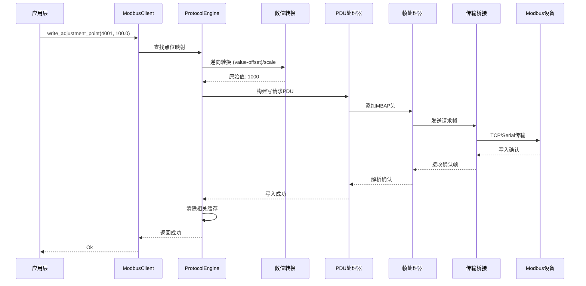
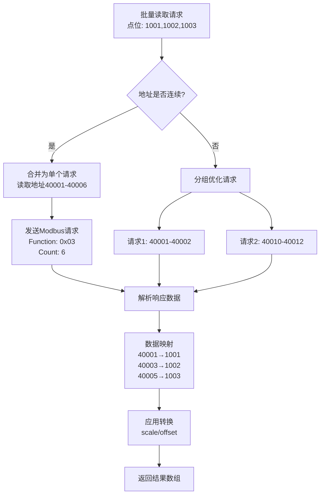
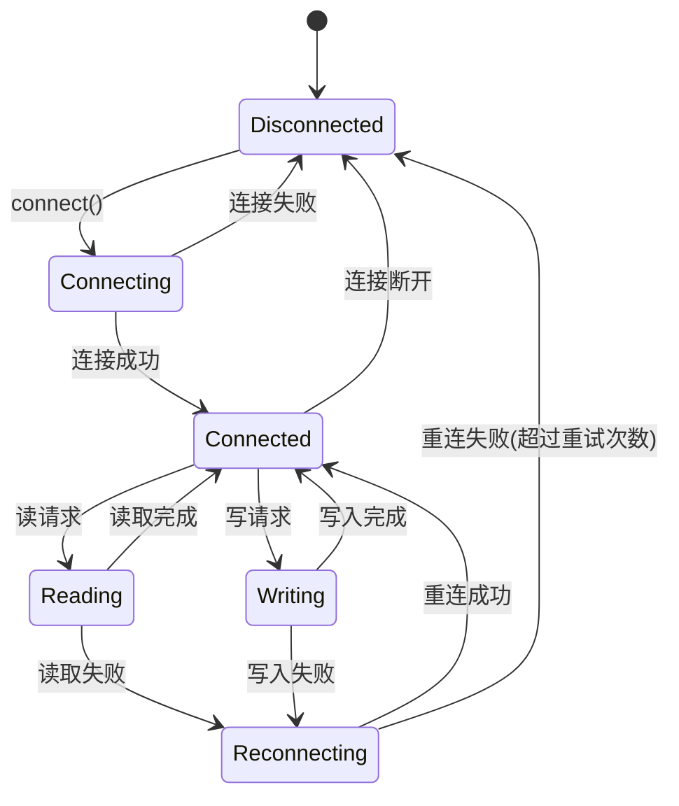
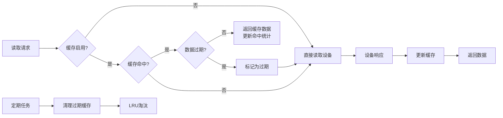
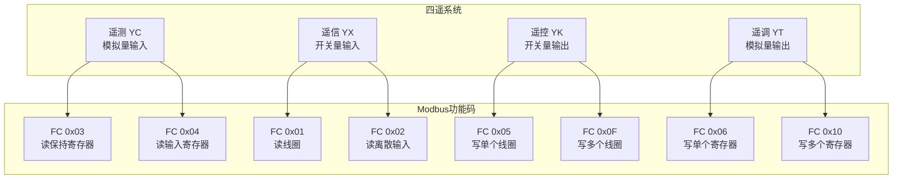

# Modbus 通信流程图

## 读取数据流程

```mermaid
sequenceDiagram
    participant App as 应用层
    participant Client as ModbusClient
    participant Engine as ProtocolEngine
    participant Cache as 缓存
    participant PDU as PDU处理器
    participant Frame as 帧处理器
    participant Bridge as 传输桥接
    participant Device as Modbus设备

    App->>Client: read_telemetry_point(1001)
    Client->>Engine: 查找点位映射
    Engine->>Cache: 检查缓存
    
    alt 缓存命中
        Cache-->>Engine: 返回缓存值
        Engine-->>Client: 返回数据
        Client-->>App: 220.5V
    else 缓存未命中
        Engine->>PDU: 构建读请求PDU
        PDU->>Frame: 添加MBAP头
        Frame->>Bridge: 发送请求帧
        Bridge->>Device: TCP/Serial传输
        Device-->>Bridge: 响应数据
        Bridge-->>Frame: 接收响应帧
        Frame-->>PDU: 解析PDU
        PDU-->>Engine: 提取寄存器值
        Engine->>Engine: 应用scale/offset
        Engine->>Cache: 更新缓存
        Engine-->>Client: 返回数据
        Client-->>App: 220.5V
    end
```

## 写入数据流程

```mermaid
sequenceDiagram
    participant App as 应用层
    participant Client as ModbusClient
    participant Engine as ProtocolEngine
    participant Convert as 数值转换
    participant PDU as PDU处理器
    participant Frame as 帧处理器
    participant Bridge as 传输桥接
    participant Device as Modbus设备

    App->>Client: write_adjustment_point(4001, 100.0)
    Client->>Engine: 查找点位映射
    Engine->>Convert: 逆向转换 (value-offset)/scale
    Convert-->>Engine: 原始值: 1000
    Engine->>PDU: 构建写请求PDU
    PDU->>Frame: 添加MBAP头
    Frame->>Bridge: 发送请求帧
    Bridge->>Device: TCP/Serial传输
    Device-->>Bridge: 写入确认
    Bridge-->>Frame: 接收确认帧
    Frame-->>PDU: 解析确认
    PDU-->>Engine: 写入成功
    Engine->>Engine: 清除相关缓存
    Engine-->>Client: 返回成功
    Client-->>App: Ok
```

## 批量读取优化流程

```mermaid
graph TD
    A[批量读取请求<br/>点位: 1001,1002,1003] --> B{地址是否连续?}
    B -->|是| C[合并为单个请求<br/>读取地址40001-40006]
    B -->|否| D[分组优化请求]
    
    C --> E[发送Modbus请求<br/>Function: 0x03<br/>Count: 6]
    D --> F[请求1: 40001-40002]
    D --> G[请求2: 40010-40012]
    
    E --> H[解析响应数据]
    F --> H
    G --> H
    
    H --> I[数据映射<br/>40001→1001<br/>40003→1002<br/>40005→1003]
    I --> J[应用转换<br/>scale/offset]
    J --> K[返回结果数组]
```

## 连接管理状态机

```mermaid
stateDiagram-v2
    [*] --> Disconnected
    Disconnected --> Connecting: connect()
    Connecting --> Connected: 连接成功
    Connecting --> Disconnected: 连接失败
    
    Connected --> Disconnected: 连接断开
    Connected --> Reading: 读请求
    Connected --> Writing: 写请求
    
    Reading --> Connected: 读取完成
    Reading --> Reconnecting: 读取失败
    
    Writing --> Connected: 写入完成
    Writing --> Reconnecting: 写入失败
    
    Reconnecting --> Connected: 重连成功
    Reconnecting --> Disconnected: 重连失败(超过重试次数)
```

## 缓存策略流程

```mermaid
graph LR
    A[读取请求] --> B{缓存启用?}
    B -->|否| C[直接读取设备]
    B -->|是| D{缓存命中?}
    
    D -->|是| E{数据过期?}
    E -->|否| F[返回缓存数据<br/>更新命中统计]
    E -->|是| G[标记为过期]
    
    D -->|否| C
    G --> C
    
    C --> H[设备响应]
    H --> I[更新缓存]
    I --> J[返回数据]
    
    K[定期任务] --> L[清理过期缓存]
    L --> M[LRU淘汰]
```

## 四遥映射关系

```mermaid
graph TB
    subgraph "四遥系统"
        YC[遥测 YC<br/>模拟量输入]
        YX[遥信 YX<br/>开关量输入]
        YK[遥控 YK<br/>开关量输出]
        YT[遥调 YT<br/>模拟量输出]
    end
    
    subgraph "Modbus功能码"
        FC03[FC 0x03<br/>读保持寄存器]
        FC04[FC 0x04<br/>读输入寄存器]
        FC01[FC 0x01<br/>读线圈]
        FC02[FC 0x02<br/>读离散输入]
        FC05[FC 0x05<br/>写单个线圈]
        FC0F[FC 0x0F<br/>写多个线圈]
        FC06[FC 0x06<br/>写单个寄存器]
        FC10[FC 0x10<br/>写多个寄存器]
    end
    
    YC --> FC03
    YC --> FC04
    YX --> FC01
    YX --> FC02
    YK --> FC05
    YK --> FC0F
    YT --> FC06
    YT --> FC10
```