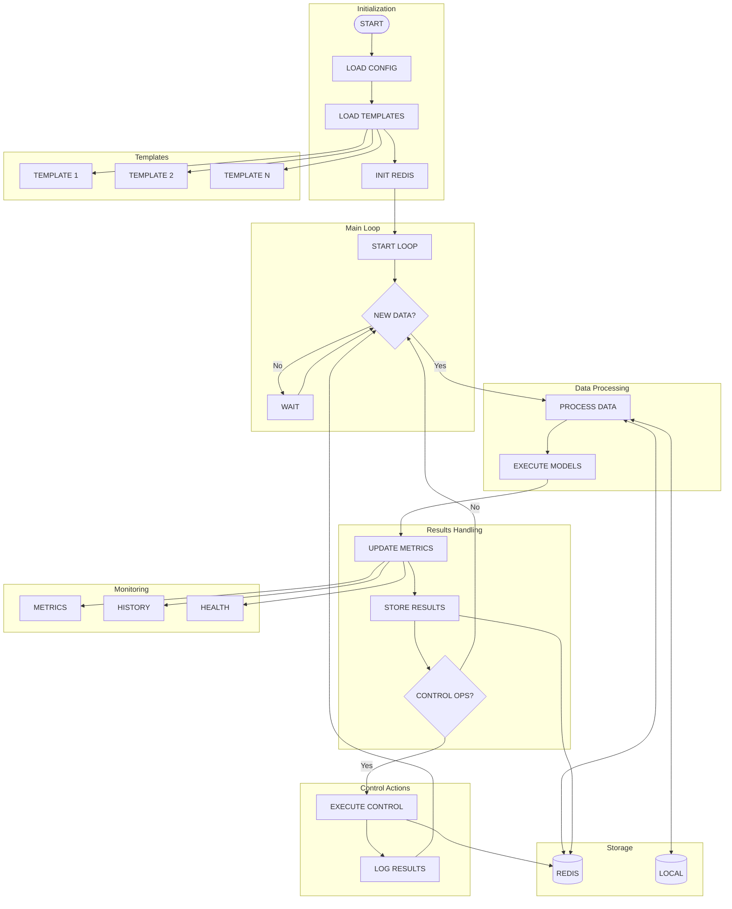

# ModSrv - Model Service

Real-time model execution service for VoltageEMS.

## Overview

ModSrv is a service that executes real-time models for monitoring and control of energy systems. It provides a flexible framework for creating and managing different types of models, with support for:

- Template-based model creation
- Real-time data processing
- Control operations
- Redis-based data storage and retrieval

## Model Execution Flow

The following diagram illustrates the complete model execution workflow:



## Requirements

- Rust 1.70 or higher
- Redis (local or remote)
- Docker and Docker Compose (for containerized deployment)

## Directory Structure

```
modsrv/
  ├── src/               # Source code
  ├── templates/         # Model templates
  ├── config/            # Configuration files
  ├── instances/         # Instance data (local storage)
  ├── Dockerfile         # Docker build file
  ├── docker-compose.yml # Docker Compose configuration
  └── Cargo.toml         # Rust project configuration
```

## Configuration

Configuration can be provided in YAML or TOML format. The service looks for configuration files in the following order:

1. Path specified by `--config` command-line argument
2. `/etc/voltageems/config/modsrv/modsrv.yaml` (Docker environment)
3. Current directory (`modsrv.yaml` or `modsrv.toml`)

Example configuration (YAML):

```yaml
redis:
  host: "localhost"  # or "redis" for Docker
  port: 6379
  password: ""
  socket: ""
  key_prefix: "ems:"
  db: 0

logging:
  level: "debug"
  file: ""
  console: true

model:
  update_interval_ms: 1000
  config_key_pattern: "ems:model:config:*"
  data_key_pattern: "ems:data:*"
  output_key_pattern: "ems:model:output:*"
  templates_dir: "templates"  # or "/opt/voltageems/modsrv/templates" for Docker

control:
  operation_key_pattern: "ems:control:operation:*"
  enabled: true

use_redis: true
storage_mode: "hybrid"
sync_interval_secs: 60
```

## Local Development

### Running Locally

To run the service locally:

```sh
# With default configuration
cargo run -- service

# With custom configuration
cargo run -- --config config/local-config.yaml service

# List available templates
cargo run -- list

# Show model information
cargo run -- info
```

### Creating Model Instances

To create a model instance from a template:

```sh
# Create a single instance
cargo run -- create <template_id> <instance_id> --name "Instance Name"

# Create multiple instances
cargo run -- create-multiple <template_id> <count> --prefix "instance" --start-index 1
```

## Docker Deployment

### Building and Running with Docker Compose

```sh
# Build and start the services
docker-compose up -d

# View logs
docker-compose logs -f modsrv

# Stop services
docker-compose down
```

### Using Docker directly

```sh
# Build the image
docker build -t voltageems/modsrv .

# Run the container
docker run -d --name modsrv \
  -v ./config:/etc/voltageems/config/modsrv \
  -v ./templates:/opt/voltageems/modsrv/templates \
  --network host \
  voltageems/modsrv
```

## Templates

Templates are stored in the `templates` directory and define the structure and behavior of model instances. Each template includes:

- Basic metadata (ID, name, description)
- Input/output mappings
- Control actions

Example template:

```yaml
id: "example_model"
name: "Example Model"
description: "A simple example model"
file_path: "templates/example.yaml"
version: "1.0.0"

input_mappings:
  - source_field: "input1"
    target_field: "model_input1"
    data_type: "string"
  - source_field: "input2"
    target_field: "model_input2"
    data_type: "float"

output_mappings:
  - source_field: "output1"
    target_field: "model_output1"
    data_type: "string"
  - source_field: "output2"
    target_field: "model_output2"
    data_type: "float"

control_actions:
  - id: "action1"
    name: "Example Action 1"
    description: "This is an example action"
    parameters:
      - name: "param1"
        description: "Example parameter"
        data_type: "string"
        default_value: "default"
```

## Control Operations

ModSrv supports control operations that can be triggered through Redis. To execute a control operation:

1. Create a control operation in Redis:
   ```
   HSET ems:control:operation:<operation_id> id <operation_id> model_id <model_id> action_id <action_id> param1 <value1> param2 <value2>
   ```
2. The service will automatically detect and execute the operation on the next update cycle.

## Monitoring and Observability

ModSrv provides comprehensive monitoring and observability features to track rule execution metrics, maintain execution history, and monitor system health.

### Overview

The monitoring system offers the following capabilities:

1. **Rule Execution Metrics**: Collect and analyze metrics for rule executions including execution counts, success rates, and timing information.
2. **Execution History**: Track historical rule executions with detailed information about inputs, outputs, and errors.
3. **Health Monitoring**: Monitor the overall system health with detailed checks and automatic recovery.
4. **Structured Logging**: Enhanced logging capabilities for better observability.

### API Endpoints

#### Rule Metrics

##### Get metrics for all rules
```
GET /api/metrics
```

Returns a map of rule IDs to metric objects containing:
- Total executions count
- Success and failure counts
- Success rate
- Execution timing statistics (min, max, avg)
- Last execution timestamp

##### Get metrics for a specific rule
```
GET /api/rules/{ruleId}/metrics
```

Returns detailed metrics for a specific rule.

#### Rule Execution History
```
GET /api/rules/{ruleId}/history?limit=10
```

Returns the execution history for a specific rule, with an optional limit parameter to control the number of entries returned.

Each history entry includes:
- Execution timestamp
- Duration
- Success status
- Input context
- Output result
- Error message (if failed)

#### Health Monitoring

##### Basic health check
```
GET /api/health
```

Returns a simple status code indicating if the service is running.

##### Detailed health check
```
GET /api/health/detailed
```

Returns detailed health information:
- Overall health status (Healthy, Degraded, Unhealthy)
- System uptime
- Memory usage
- Number of rules loaded
- Redis connection status
- Individual component health checks

### Using Monitoring Features

#### Tracking Rule Performance

The monitoring system automatically tracks metrics for all rule executions. These metrics can be used to:

1. Identify slow-running rules
2. Monitor success rates for specific rules
3. Track execution patterns over time

Example usage:
```javascript
// Get metrics for all rules
fetch('/api/metrics')
  .then(response => response.json())
  .then(metrics => {
    // Find rules with high failure rates
    const problematicRules = Object.entries(metrics)
      .filter(([_, m]) => m.success_rate < 0.9)
      .map(([id, _]) => id);
    
    console.log('Rules with high failure rates:', problematicRules);
  });
```

#### Debugging Rule Execution

When a rule fails, you can use the history API to investigate:
```javascript
// Get recent execution history for a rule
fetch('/api/rules/my-rule-id/history?limit=5')
  .then(response => response.json())
  .then(history => {
    // Check the most recent execution
    const lastExecution = history[0];
    console.log('Last execution status:', lastExecution.success ? 'Success' : 'Failed');
    if (!lastExecution.success) {
      console.log('Error:', lastExecution.error);
      console.log('Input context:', lastExecution.context);
    }
  });
```

#### Monitoring System Health

You can integrate the health check endpoint into your monitoring system:
```javascript
// Check system health
fetch('/api/health/detailed')
  .then(response => response.json())
  .then(health => {
    if (health.status !== 'Healthy') {
      console.warn('System health is degraded:', health.status);
      
      // Check specific components
      const unhealthyChecks = Object.entries(health.checks)
        .filter(([_, check]) => check.status !== 'Healthy')
        .map(([id, check]) => ({ id, details: check.details }));
      
      console.warn('Unhealthy components:', unhealthyChecks);
    }
  });
```

### Automatic Recovery

The monitoring system includes automatic recovery mechanisms for certain failure scenarios:

1. **Redis Connection Issues**: The system will attempt to reconnect to Redis if the connection is lost.
2. **Rule Execution Failures**: Individual rule failures are isolated and won't affect the execution of other rules.

### Retention Policies

By default, the system maintains:
- The most recent 1000 execution history entries across all rules
- All metrics, which are persisted to Redis for durability

These limits can be configured in the application settings.

### Integration with External Systems

The metrics and health endpoints are designed to be compatible with common monitoring systems such as Prometheus, Grafana, and ELK stack. 

For Prometheus integration, consider using the Prometheus Redis exporter to expose Redis metrics, including the rule execution metrics stored in Redis.

### Log Levels

The application uses structured logging with the following levels:
- **ERROR**: Critical issues that require immediate attention
- **WARN**: Potentially problematic situations that might require attention
- **INFO**: Important events and status updates
- **DEBUG**: Detailed information for debugging purposes

The log level can be configured in the `docker-compose.yml` file:
```yaml
environment:
  - RUST_LOG=debug  # Set to info, debug, or trace as needed
```

## License

Copyright © 2024 VoltageEMS. All rights reserved.

