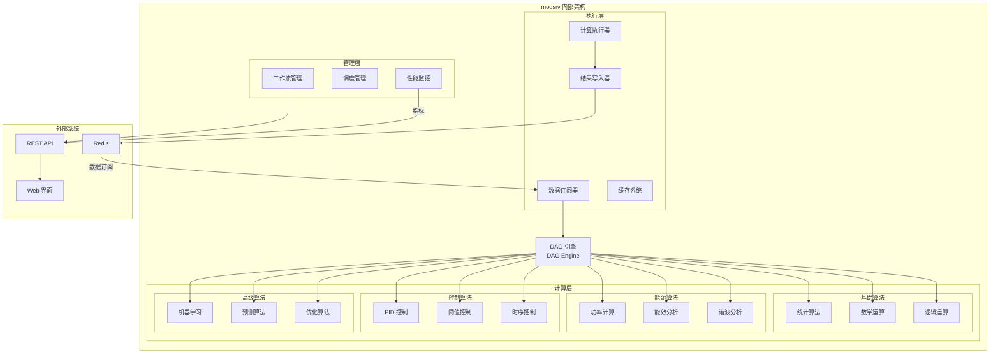

# 模型服务 (Model Service - modsrv)

## 功能概述

modsrv 是 VoltageEMS 系统的实时计算引擎，负责执行各种能源管理算法和控制逻辑。该服务基于有向无环图（DAG）架构，支持灵活的计算流程编排和实时数据处理。

## 主要功能

### 1. DAG 计算引擎
- **工作流编排**: 支持复杂计算流程的可视化配置
- **并行计算**: 自动识别可并行执行的计算节点
- **依赖管理**: 智能处理节点间的数据依赖关系
- **动态调度**: 根据数据变化触发相应计算

### 2. 内置算法库
- **统计计算**: 平均值、最大值、最小值、标准差等
- **能源计算**: 功率因数、谐波分析、能耗统计
- **控制算法**: PID 控制、阈值控制、时序控制
- **预测算法**: 负荷预测、故障预测、趋势分析

### 3. 实时处理
- 从 Redis 订阅数据变化
- 毫秒级计算响应
- 计算结果实时写回 Redis
- 支持批量数据处理

### 4. 扩展能力
- 插件式算法扩展
- 自定义函数支持
- Python/Lua 脚本集成
- REST API 算法调用

## 架构设计



## 配置说明

### 主配置文件 (config.yaml)
```yaml
redis:
  url: "redis://127.0.0.1:6379"
  
server:
  port: 8082
  
engine:
  max_workers: 10
  cache_size: 1000
  
workflows:
  - name: "power_calculation"
    trigger: "data_change"
    nodes:
      - id: "read_voltage"
        type: "redis_read"
        key: "voltage_*"
      - id: "read_current"
        type: "redis_read"
        key: "current_*"
      - id: "calc_power"
        type: "power_calc"
        inputs: ["read_voltage", "read_current"]
      - id: "write_result"
        type: "redis_write"
        key: "power_*"
        input: "calc_power"
```

### 工作流定义 (workflow.yaml)
```yaml
name: "能源优化流程"
description: "实时能源消耗优化计算"
nodes:
  - id: "data_collection"
    type: "batch_read"
    config:
      keys: ["meter_*", "sensor_*"]
      
  - id: "data_validation"
    type: "quality_check"
    inputs: ["data_collection"]
    
  - id: "energy_calculation"
    type: "custom_script"
    script: "energy_optimizer.py"
    inputs: ["data_validation"]
    
  - id: "control_output"
    type: "control_signal"
    inputs: ["energy_calculation"]
    outputs:
      - key: "control_*"
        ttl: 3600
```

## 内置算法说明

### 统计类算法
- `avg`: 平均值计算
- `sum`: 求和计算
- `max/min`: 最大/最小值
- `std`: 标准差
- `median`: 中位数

### 能源类算法
- `power_factor`: 功率因数计算
- `thd`: 总谐波失真
- `energy_consumption`: 能耗统计
- `demand_response`: 需求响应
- `peak_shaving`: 削峰填谷

### 控制类算法
- `pid`: PID 控制器
- `threshold`: 阈值控制
- `schedule`: 时间计划控制
- `cascade`: 级联控制

## 部署说明

### Docker 部署
```bash
docker build -t modsrv .
docker run -d --name modsrv \
  -v ./config:/app/config \
  -v ./scripts:/app/scripts \
  -p 8082:8082 \
  --network voltageems_net \
  modsrv
```

### 本地开发
```bash
cd services/modsrv
cargo build --release
RUST_LOG=info cargo run
```

## API 接口

### 工作流管理
- `GET /api/workflows`: 获取所有工作流
- `POST /api/workflows`: 创建新工作流
- `PUT /api/workflows/{id}`: 更新工作流
- `DELETE /api/workflows/{id}`: 删除工作流
- `POST /api/workflows/{id}/run`: 手动触发工作流

### 算法管理
- `GET /api/algorithms`: 获取可用算法列表
- `POST /api/algorithms/test`: 测试算法执行
- `GET /api/algorithms/{id}/doc`: 获取算法文档

### 性能监控
- `GET /metrics`: Prometheus 指标
- `GET /api/stats`: 实时统计信息
- `GET /api/performance`: 性能分析数据

## 扩展开发

### 添加自定义算法
1. 实现 `Algorithm` trait
2. 注册到算法工厂
3. 更新配置模板
4. 编写单元测试

### 集成外部脚本
1. 将脚本放置在 `scripts/` 目录
2. 在工作流中配置 `custom_script` 节点
3. 定义输入输出映射

## 监控指标

- `modsrv_workflows_active`: 活跃工作流数量
- `modsrv_calculations_total`: 计算执行总数
- `modsrv_calculation_duration_seconds`: 计算耗时
- `modsrv_errors_total`: 错误总数
- `modsrv_cache_hit_ratio`: 缓存命中率

## 故障排查

1. **计算结果异常**: 检查输入数据质量和算法参数
2. **性能问题**: 优化工作流并行度，增加工作线程
3. **内存占用高**: 调整缓存大小，检查数据泄漏
4. **工作流不触发**: 验证触发条件和 Redis 订阅

## 相关服务

- **comsrv**: 提供原始数据输入
- **hissrv**: 存储计算结果历史
- **alarmsrv**: 基于计算结果生成告警
- **netsrv**: 上传计算结果到云端