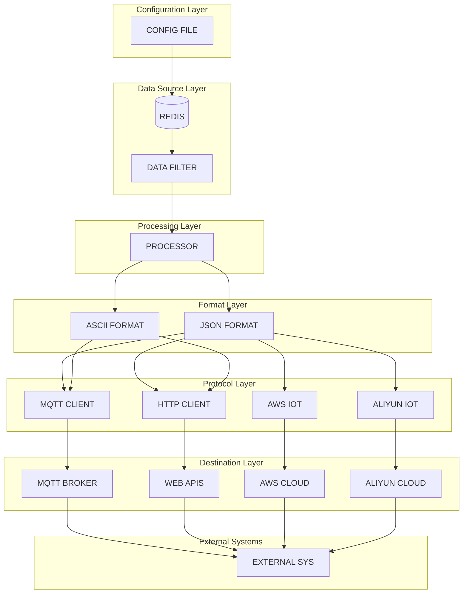

# Network Service (Netsrv)

Netsrv transfers data from Redis to external systems over various network protocols such as MQTT, HTTP, AWS IoT Core and Aliyun IoT.

## Features
- Reads real-time data from Redis
- Supports MQTT, HTTP/HTTPS, AWS IoT Core and Aliyun IoT
- JSON or ASCII payload formats
- Configurable data filtering
- Asynchronous processing for efficient throughput
- Fully configurable without code changes

## Architecture



The service runs in a Docker container and interacts with:
- Redis for source data
- Optional MQTT broker
- External APIs or cloud services

## Configuration
The service is configured with `netsrv.json`. Example:
```json
{
  "redis": {
    "host": "localhost",
    "port": 6379,
    "password": "",
    "prefix": "ems:",
    "data_keys": ["ems:model:output:*", "ems:data:*"],
    "poll_interval_ms": 1000
  },
  "logging": {
    "level": "info",
    "file": "/var/log/ems/netsrv.log",
    "console": true
  }
}
```
Network-specific sections further define MQTT, HTTP or cloud options.