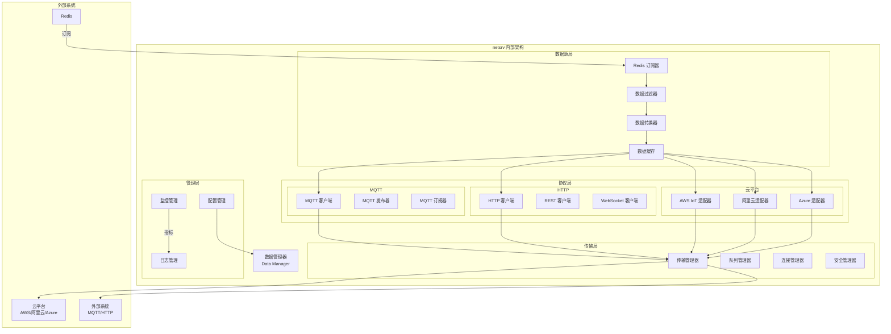

# 网络服务 (Network Service - netsrv)

## 功能概述

netsrv 是 VoltageEMS 系统的数据转发服务，负责将本地采集的数据通过各种网络协议转发到云平台和外部系统。该服务支持多种通信协议和云平台，是系统与外部世界连接的桥梁。

## 主要功能

### 1. 多协议支持
- **MQTT**: 支持 MQTT 3.1.1 和 5.0，适用于物联网场景
- **HTTP/HTTPS**: RESTful API 数据推送
- **WebSocket**: 实时双向通信
- **TCP/UDP**: 原始套接字通信

### 2. 云平台集成
- **AWS IoT Core**: 原生支持 AWS 物联网平台
- **阿里云 IoT**: 集成阿里云物联网套件
- **Azure IoT Hub**: 支持微软 Azure 物联网
- **私有云**: 可配置任意 MQTT/HTTP 端点

### 3. 数据处理
- **格式转换**: JSON、XML、二进制等格式转换
- **数据过滤**: 按规则过滤需要上传的数据
- **数据聚合**: 批量上传优化网络带宽
- **压缩加密**: 支持数据压缩和 TLS 加密

### 4. 可靠性保障
- **断线重连**: 自动检测并恢复网络连接
- **本地缓存**: 离线数据本地缓存
- **QoS 保证**: MQTT QoS 0/1/2 支持
- **重试机制**: 失败数据自动重试

## 架构设计



## 配置说明

### 主配置文件 (netsrv.json)
```json
{
  "redis": {
    "url": "redis://127.0.0.1:6379",
    "subscribe_patterns": ["telemetry:*", "signal:*", "control:*"]
  },
  
  "endpoints": [
    {
      "name": "aws_iot",
      "type": "mqtt",
      "enabled": true,
      "config": {
        "host": "xxxxx.iot.region.amazonaws.com",
        "port": 8883,
        "client_id": "voltageems_device_001",
        "use_tls": true,
        "cert_file": "./certs/device.pem",
        "key_file": "./certs/device.key",
        "ca_file": "./certs/root-ca.pem"
      },
      "topics": {
        "telemetry": "devices/${device_id}/telemetry",
        "control": "devices/${device_id}/control"
      }
    },
    {
      "name": "aliyun_iot",
      "type": "mqtt",
      "enabled": true,
      "config": {
        "host": "xxxxx.iot-as-mqtt.cn-shanghai.aliyuncs.com",
        "port": 1883,
        "username": "device_name&product_key",
        "password": "calculated_signature",
        "client_id": "client_id|securemode=3,signmethod=hmacsha1|"
      }
    },
    {
      "name": "http_endpoint",
      "type": "http",
      "enabled": true,
      "config": {
        "url": "https://api.example.com/data",
        "method": "POST",
        "headers": {
          "Authorization": "Bearer ${API_TOKEN}",
          "Content-Type": "application/json"
        },
        "batch_size": 100,
        "timeout": 30
      }
    }
  ],
  
  "data_processing": {
    "format": "json",
    "compression": "gzip",
    "batch_size": 50,
    "flush_interval": 10,
    "filters": [
      {
        "type": "whitelist",
        "patterns": ["voltage_*", "current_*", "power_*"]
      }
    ]
  },
  
  "reliability": {
    "retry_attempts": 3,
    "retry_delay": 5,
    "offline_queue_size": 10000,
    "persistent_queue": true
  }
}
```

### 数据格式配置
```yaml
formatters:
  - name: "aws_format"
    type: "json"
    template: |
      {
        "device_id": "${device_id}",
        "timestamp": ${timestamp},
        "data": {
          "type": "${point_type}",
          "value": ${value},
          "unit": "${unit}"
        }
      }
      
  - name: "aliyun_format"
    type: "json"
    template: |
      {
        "id": "${message_id}",
        "version": "1.0",
        "params": {
          "${point_name}": {
            "value": ${value},
            "time": ${timestamp}
          }
        },
        "method": "thing.event.property.post"
      }
```

## 云平台配置

### AWS IoT Core
1. 创建物联网设备
2. 下载设备证书
3. 配置设备策略
4. 更新 netsrv 配置

### 阿里云 IoT
1. 创建产品和设备
2. 获取三元组信息
3. 配置物模型
4. 更新 netsrv 配置

### Azure IoT Hub
1. 创建 IoT Hub
2. 注册设备
3. 获取连接字符串
4. 更新 netsrv 配置

## 部署说明

### Docker 部署
```bash
docker build -t netsrv .
docker run -d --name netsrv \
  -v ./config:/app/config \
  -v ./certs:/app/certs \
  -p 8083:8083 \
  --network voltageems_net \
  netsrv
```

### 本地开发
```bash
cd services/netsrv
cargo build --release
RUST_LOG=info cargo run
```

## API 接口

### 管理 API
- `GET /api/endpoints`: 获取所有端点状态
- `POST /api/endpoints/{name}/enable`: 启用端点
- `POST /api/endpoints/{name}/disable`: 禁用端点
- `GET /api/endpoints/{name}/stats`: 获取端点统计

### 数据 API
- `POST /api/send`: 手动发送数据
- `GET /api/queue/status`: 获取队列状态
- `POST /api/queue/flush`: 强制刷新队列

### 监控 API
- `GET /metrics`: Prometheus 指标
- `GET /api/health`: 健康检查
- `GET /api/connections`: 连接状态

## 监控指标

- `netsrv_messages_sent_total`: 发送消息总数
- `netsrv_messages_failed_total`: 失败消息总数
- `netsrv_queue_size`: 当前队列大小
- `netsrv_connection_status`: 连接状态
- `netsrv_bytes_sent_total`: 发送字节总数

## 故障排查

1. **连接失败**: 检查网络、证书和认证信息
2. **数据未上传**: 验证数据过滤规则和格式
3. **性能问题**: 调整批量大小和发送间隔
4. **证书错误**: 确保证书有效且路径正确

## 安全考虑

1. **传输加密**: 始终使用 TLS/SSL
2. **认证安全**: 妥善保管证书和密钥
3. **数据脱敏**: 敏感数据本地处理
4. **访问控制**: 限制 API 访问权限

## 相关服务

- **comsrv**: 原始数据来源
- **modsrv**: 计算结果数据
- **hissrv**: 历史数据查询
- **alarmsrv**: 告警数据上传