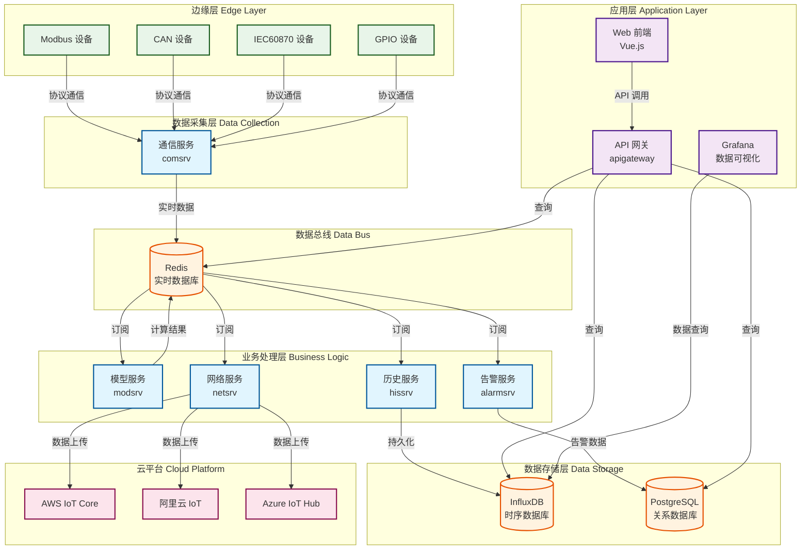
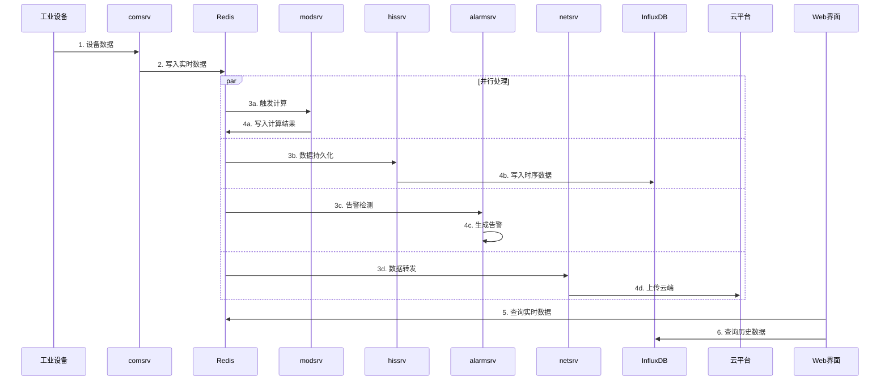
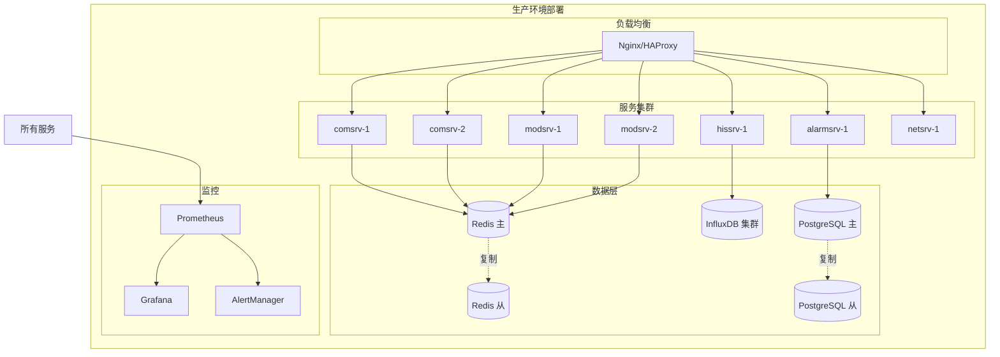

# VoltageEMS 系统架构说明

## 系统概述

VoltageEMS 是一个基于微服务架构的工业物联网能源管理系统，专为电力监控、能源管理和设备控制而设计。系统采用 Rust 语言开发核心服务，确保高性能和可靠性，同时提供友好的 Web 界面进行监控和管理。

## 核心特性

- **高性能**: 基于 Rust 开发，内存安全，性能卓越
- **可扩展**: 微服务架构，各服务独立部署和扩展
- **多协议**: 支持 Modbus、CAN、IEC60870 等工业协议
- **云原生**: 容器化部署，支持主流云平台
- **实时性**: 毫秒级数据采集和响应
- **可视化**: 集成 Grafana，提供丰富的数据展示

## 整体架构



## 数据流架构



## 服务说明

### 1. 通信服务 (comsrv)
- **功能**: 工业协议通信和数据采集
- **端口**: 8081
- **职责**: 
  - 支持多种工业协议
  - 设备连接管理
  - 数据格式转换
  - 实时数据写入 Redis

### 2. 模型服务 (modsrv)
- **功能**: 实时计算和控制逻辑
- **端口**: 8082
- **职责**:
  - DAG 工作流引擎
  - 内置算法库
  - 自定义脚本支持
  - 控制指令下发

### 3. 历史服务 (hissrv)
- **功能**: 历史数据存储和查询
- **端口**: 8090
- **职责**:
  - 数据持久化到 InfluxDB
  - 历史数据查询 API
  - Grafana 数据源
  - 数据聚合和降采样

### 4. 网络服务 (netsrv)
- **功能**: 数据转发和云平台集成
- **端口**: 8083
- **职责**:
  - MQTT/HTTP 数据推送
  - 云平台适配器
  - 离线缓存
  - 数据格式转换

### 5. 告警服务 (alarmsrv)
- **功能**: 智能告警管理
- **端口**: 8084
- **职责**:
  - 实时告警检测
  - 告警分类和抑制
  - 多渠道通知
  - 告警生命周期管理

## 技术栈

### 后端技术
- **编程语言**: Rust
- **Web 框架**: Actix-web
- **异步运行时**: Tokio
- **配置管理**: Figment
- **日志系统**: tracing/env_logger

### 数据存储
- **实时数据**: Redis
- **时序数据**: InfluxDB
- **关系数据**: PostgreSQL
- **配置文件**: YAML/JSON

### 前端技术
- **框架**: Vue.js 3
- **UI 组件**: Element Plus
- **图表**: ECharts
- **可视化**: Grafana
- **桌面应用**: Electron

### 部署技术
- **容器化**: Docker
- **编排**: Docker Compose
- **监控**: Prometheus + Grafana
- **日志**: ELK Stack

## 部署架构



## 安全架构

### 网络安全
- TLS/SSL 加密通信
- VPN 隧道保护
- 防火墙规则
- DDoS 防护

### 应用安全
- JWT 身份认证
- RBAC 权限控制
- API 限流
- 数据加密

### 数据安全
- 敏感数据脱敏
- 备份加密
- 审计日志
- 访问控制

## 性能指标

- **数据采集**: 支持 10,000+ 数据点/秒
- **计算延迟**: < 100ms
- **存储容量**: PB 级数据存储
- **并发连接**: 1,000+ 设备同时连接
- **系统可用性**: 99.9%

## 扩展性设计

### 水平扩展
- 无状态服务设计
- 负载均衡分发
- 数据分片存储
- 消息队列解耦

### 垂直扩展
- 资源动态分配
- 缓存优化
- 算法优化
- 硬件加速

## 开发指南

### 环境搭建
```bash
# 克隆代码
git clone https://github.com/voltageems/voltageems.git

# 启动依赖服务
docker-compose up -d redis influxdb postgres

# 编译服务
cd services/comsrv && cargo build

# 运行服务
cargo run
```

### 新增服务
1. 在 `services/` 目录创建新服务
2. 实现 Redis 数据订阅/发布
3. 配置 Docker 镜像
4. 更新 docker-compose.yml
5. 编写服务文档

### 贡献指南
1. Fork 项目
2. 创建功能分支
3. 提交代码
4. 编写测试
5. 提交 Pull Request

## 运维指南

### 监控告警
- Prometheus 采集指标
- Grafana 展示面板
- AlertManager 告警通知
- 日志集中分析

### 备份恢复
- Redis 定期快照
- InfluxDB 连续备份
- PostgreSQL 主从复制
- 配置文件版本控制

### 故障处理
- 服务健康检查
- 自动故障转移
- 熔断降级机制
- 灾难恢复计划

## 路线图

### 短期计划
- [ ] 支持 OPC UA 协议
- [ ] 增加边缘计算能力
- [ ] 优化数据压缩算法
- [ ] 完善 API 文档

### 中期计划
- [ ] AI 预测性维护
- [ ] 分布式部署支持
- [ ] 多租户架构
- [ ] 移动端应用

### 长期愿景
- [ ] 支持更多工业协议
- [ ] 建立生态系统
- [ ] 行业解决方案
- [ ] 国际化支持